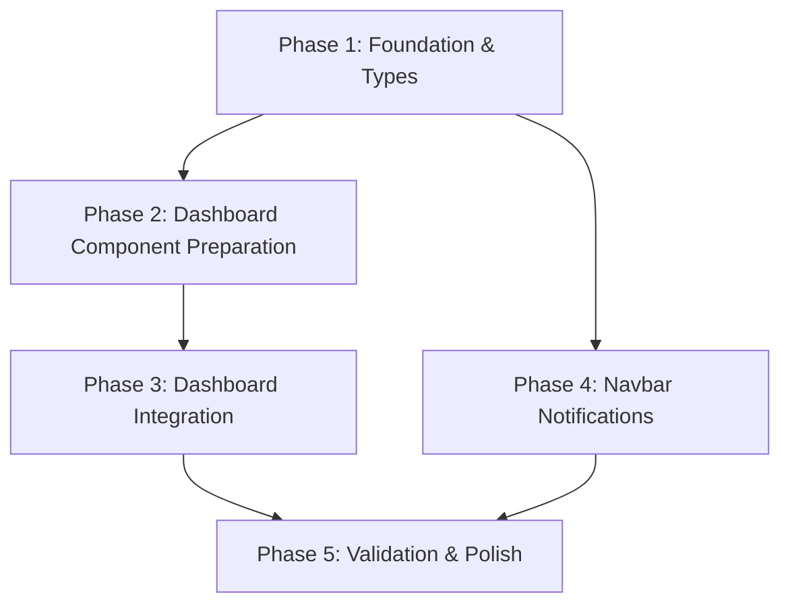

# Implementation Plan: Dynamic Layout & Personalized Tool Ordering

**Status**: Draft
**Date**: 2026-03-18
**Author**: Gemini CLI

## 1. Plan Overview

This plan outlines the steps to implement a dynamic, personalized dashboard and an interactive navbar with notification indicators ("red dots").

- **Total Phases**: 5
- **Agents Involved**: `coder`, `api_designer`, `tester`, `architect`
- **Estimated Effort**: Medium

---

## 2. Dependency Graph

---

## 3. Execution Strategy Table

| Phase | Description | Agent | Parallel |
|-------|-------------|-------|----------|
| 1 | Foundation (Types & Hook) | `api_designer` | No |
| 2 | Component Prep (Polls/Leaderboard) | `coder` | Yes (with P4) |
| 3 | Dashboard Integration | `coder` | No |
| 4 | Navbar Notifications | `coder` | Yes (with P2) |
| 5 | Validation & Polish | `tester` | No |

---

## 4. Phase Details

### Phase 1: Foundation & Types
- **Objective**: Define types and implement the core sorting logic.
- **Agent**: `api_designer`
- **Files to Create**:
    - `src/hooks/useDashboardSorting.ts`: Implements the `useDashboardSorting` hook.
- **Files to Modify**:
    - `src/types/database.ts`: Add `DashboardComponentKey` type.
- **Implementation Details**:
    - `DashboardComponentKey = 'funding' | 'news' | 'todos' | 'events' | 'polls' | 'leaderboard'`
    - `useDashboardSorting` should take `profile`, `todos`, `events`, `polls`, `news` as arguments.
    - Implement the scoring logic as defined in the design document.

### Phase 2: Dashboard Component Preparation
- **Objective**: Ensure all dashboard components are ready for dynamic rendering.
- **Agent**: `coder`
- **Files to Modify**:
    - `src/components/dashboard/PollList.tsx`: Ensure it can be used as a preview widget.
    - `src/components/dashboard/ClassLeaderboard.tsx`: Ensure it can be used as a preview widget.
- **Implementation Details**:
    - Standardize props if necessary (e.g., adding a `limit` prop to `PollList` for dashboard preview).

### Phase 3: Dashboard Integration
- **Objective**: Refactor the main dashboard to use dynamic sorting.
- **Agent**: `coder`
- **Files to Modify**:
    - `src/app/page.tsx`:
        - Fetch all collections (polls, news, etc.).
        - Use `useDashboardSorting` hook.
        - Map sorted keys to components.
        - Implement a responsive grid layout that adapts to the sorted order.

### Phase 4: Navbar Notifications
- **Objective**: Add "red dot" indicators to the navigation.
- **Agent**: `coder`
- **Files to Modify**:
    - `src/components/layout/Navbar.tsx`:
        - Add real-time subscriptions for "Action Items".
        - Render a red dot indicator next to items that have active notifications.
- **Implementation Details**:
    - Create a small helper component or CSS class for the red dot.
    - Optimize subscriptions to avoid excessive re-renders.

### Phase 5: Validation & Polish
- **Objective**: Ensure everything works as expected across different scenarios.
- **Agent**: `tester`
- **Verification Criteria**:
    - Log in as a user with an assigned todo -> `TodoList` moves to the top.
    - Create a new poll -> Red dot appears next to "Umfragen" in navbar.
    - Verify layout on mobile (sidebar vs. top bar).
    - Ensure "viewer" role sees a sensible default order.

---

## 5. File Inventory

| File Path | Phase | Purpose |
|-----------|-------|---------|
| `src/types/database.ts` | 1 | Define new layout-related types. |
| `src/hooks/useDashboardSorting.ts` | 1 | Core sorting logic. |
| `src/components/dashboard/PollList.tsx` | 2 | Prepare for dashboard integration. |
| `src/components/dashboard/ClassLeaderboard.tsx` | 2 | Prepare for dashboard integration. |
| `src/app/page.tsx` | 3 | Dynamic dashboard rendering. |
| `src/components/layout/Navbar.tsx` | 4 | Notification indicators. |

---

## 6. Execution Profile
- Total phases: 5
- Parallelizable phases: 2 (P2 and P4)
- Sequential-only phases: 3
- Estimated Wall Time: ~45-60 minutes

---

## 7. Cost Estimation

| Phase | Agent | Model | Est. Input | Est. Output | Est. Cost |
|-------|-------|-------|-----------|------------|----------|
| 1 | api_designer | Pro | 2000 | 500 | $0.04 |
| 2 | coder | Pro | 3000 | 800 | $0.06 |
| 3 | coder | Pro | 5000 | 1200 | $0.10 |
| 4 | coder | Pro | 4000 | 1000 | $0.08 |
| 5 | tester | Pro | 3000 | 500 | $0.05 |
| **Total** | | | **17000** | **4000** | **~$0.33** |
