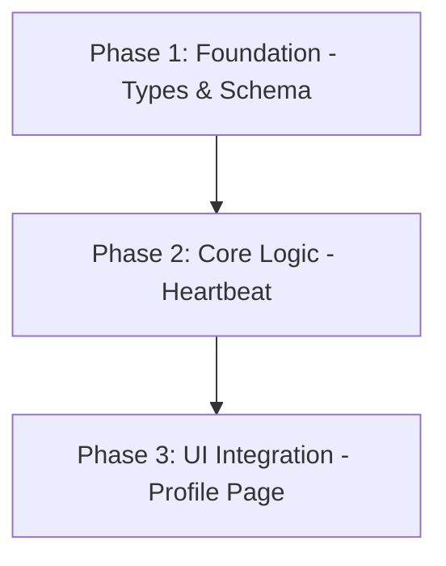

# Implementation Plan: User Online Status Feature

## Plan Overview
This plan outlines the implementation of an "online" and "last online" status for user profiles in the ABI Planer project. The feature will use a Firestore heartbeat mechanism centralized in the `AuthContext` to maintain near real-time status.

- **Total Phases:** 3
- **Agents Involved:** `data_engineer`, `coder`
- **Estimated Effort:** ~2 hours

## Dependency Graph

## Execution Strategy Table

| Phase | Stage | Agent | Execution Mode |
|-------|-------|-------|----------------|
| 1 | Foundation | `data_engineer` | Sequential |
| 2 | Implementation | `coder` | Sequential |
| 3 | UI & Polish | `coder` | Sequential |

## Phase Details

### Phase 1: Foundation - Types & Schema
**Objective:** Update the `Profile` type to include online status fields.

- **Agent Assignment:** `data_engineer`
- **Rationale:** Handles database schema and type definitions.

- **Files to Modify:**
  - `src/types/database.ts`: Add `isOnline: boolean` and `lastOnline: Timestamp | Date` to the `Profile` interface.

- **Validation Criteria:**
  - `npm run check` (TypeScript verification)

- **Dependencies:**
  - `blocked_by`: []
  - `blocks`: [2]

---

### Phase 2: Core Logic - Heartbeat
**Objective:** Implement the heartbeat timer and cleanup logic in `AuthContext`.

- **Agent Assignment:** `coder`
- **Rationale:** Familiar with React Context and Firebase updates.

- **Files to Modify:**
  - `src/context/AuthContext.tsx`:
    - Add a `useEffect` that starts a 2-minute `setInterval` when the user is logged in.
    - Every 2 mins: `updateDoc(doc(db, 'profiles', user.uid), { isOnline: true, lastOnline: serverTimestamp() })`.
    - Add a `beforeunload` window listener to set `isOnline: false` on tab close/unload.
    - Ensure proper cleanup of the interval and listener.

- **Validation Criteria:**
  - Verify Firestore updates for the current user in the Firebase Console.
  - `npm run lint`

- **Dependencies:**
  - `blocked_by`: [1]
  - `blocks`: [3]

---

### Phase 3: UI Integration - Profile Page
**Objective:** Display the online status on the public profile page.

- **Agent Assignment:** `coder`
- **Rationale:** Handles UI components and formatting.

- **Files to Modify:**
  - `src/app/profil/[id]/page.tsx`:
    - Display a status indicator (e.g., a green dot for "Online").
    - Display "Last seen [relative time]" if the user is offline, using `lastOnline`.
    - Handle the "stale session" fallback (if `isOnline: true` but `lastOnline > 5 mins`, show as offline).
  - `src/lib/utils.ts` (Optional): Add a helper for relative time formatting if not already available (the project uses `date-fns`).

- **Validation Criteria:**
  - Manual verification on `/profil/[id]` for different users.
  - `npm run check`

- **Dependencies:**
  - `blocked_by`: [2]
  - `blocks`: []

## File Inventory

| Phase | Action | Path | Purpose |
|-------|--------|------|---------|
| 1 | Modify | `src/types/database.ts` | Update Profile type |
| 2 | Modify | `src/context/AuthContext.tsx` | Implement Heartbeat |
| 3 | Modify | `src/app/profil/[id]/page.tsx` | Display status UI |
| 3 | Modify | `src/lib/utils.ts` | Relative time formatting helper |

## Risk Classification

| Phase | Risk | Rationale |
|-------|------|-----------|
| 1 | LOW | Simple type change. |
| 2 | MEDIUM | Requires careful cleanup of timers and listeners to avoid memory leaks or redundant writes. |
| 3 | LOW | UI-only change. |

## Execution Profile
- Total phases: 3
- Parallelizable phases: 0
- Sequential-only phases: 3
- Estimated parallel wall time: N/A
- Estimated sequential wall time: ~1.5 hours

## Cost Estimation

| Phase | Agent | Model | Est. Input | Est. Output | Est. Cost |
|-------|-------|-------|-----------|------------|----------|
| 1 | `data_engineer` | Pro | 2,000 | 500 | $0.04 |
| 2 | `coder` | Pro | 5,000 | 1,000 | $0.13 |
| 3 | `coder` | Pro | 8,000 | 2,000 | $0.24 |
| **Total** | | | **15,000** | **3,500** | **$0.41** |
