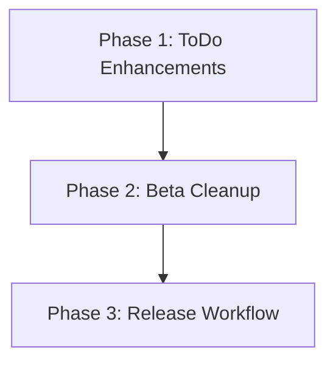

# Implementation Plan: ToDo Details & Beta Cleanup

**Date:** 2026-03-20
**Task Complexity:** Medium
**Design Document:** [2026-03-20-todo-details-and-beta-cleanup-design.md](./2026-03-20-todo-details-and-beta-cleanup-design.md)

## 1. Plan Overview
This plan focuses on enhancing the ToDo system with a DetailView and depth limits, cleaning up the UI for release, and managing the release branch.

- **Total Phases:** 3
- **Agents:** `coder`, `devops_engineer`
- **Estimated Effort:** Moderate

## 2. Dependency Graph

## 3. Execution Strategy Table
| Phase | Agent | Mode | Objective |
|-------|-------|------|-----------|
| 1 | `coder` | Sequential | Implement DetailView and depth limits |
| 2 | `coder` | Sequential | Remove Beta labels across the UI |
| 3 | `devops_engineer` | Sequential | Git release, versioning, and changelog |

## 4. Phase Details

### Phase 1: ToDo Enhancements
- **Objective:** Implement the DetailView Dialog and enforce the 5-level sub-task limit.
- **Agent:** `coder`
- **Files to Create:**
    - `src/components/modals/TodoDetailDialog.tsx`: A read-only dialog showing task title, description, status, due date, and immediate sub-tasks.
- **Files to Modify:**
    - `src/components/dashboard/TodoList.tsx`: 
        - Trigger `TodoDetailDialog` when the title is clicked.
        - Wrap `AddTodoDialog` trigger with `todo.depth < 4` check to enforce the limit.
- **Validation:**
    - `npm run check`
    - Manually verify that clicking a title opens the dialog.
    - Manually verify that the "Add Sub-task" button is hidden at depth 4.
- **Dependencies:** None

### Phase 2: Beta Cleanup
- **Objective:** Remove all "Beta" labels and indicators from the application.
- **Agent:** `coder`
- **Files to Modify:**
    - `src/app/page.tsx`: Remove "Beta" badge from Dashboard.
    - `src/components/layout/Navbar.tsx`: Set `isBeta: false` for all navigation items.
    - `src/app/gruppen/page.tsx`: Remove "Beta" badge.
    - `src/app/admin/logs/page.tsx`: Remove "Beta" badge.
- **Validation:**
    - `npm run check`
    - Manually verify that no "Beta" labels are visible in the UI.
- **Dependencies:** `blocked_by: [1]`

### Phase 3: Release Workflow
- **Objective:** Manage the Git release, update versioning, and final changelog.
- **Agent:** `devops_engineer`
- **Files to Modify:**
    - `CHANGELOG.md`: Document Phase 1 and 2 changes.
    - `VERSION`: Increment version to `1.2.0` (as it's a feature release).
- **Implementation Details:**
    - `git checkout -b release`
    - Commit all changes.
    - Push to `release` branch.
- **Validation:**
    - `git status`
    - `npm run check`
- **Dependencies:** `blocked_by: [2]`

## 5. File Inventory
| Phase | Action | Path | Purpose |
|-------|--------|------|---------|
| 1 | Create | `src/components/modals/TodoDetailDialog.tsx` | Detail view component |
| 1 | Modify | `src/components/dashboard/TodoList.tsx` | Trigger and depth limit |
| 2 | Modify | `src/app/page.tsx` | Cleanup Beta |
| 2 | Modify | `src/components/layout/Navbar.tsx` | Cleanup Beta |
| 2 | Modify | `src/app/gruppen/page.tsx` | Cleanup Beta |
| 2 | Modify | `src/app/admin/logs/page.tsx` | Cleanup Beta |
| 3 | Modify | `CHANGELOG.md` | Release notes |
| 3 | Modify | `VERSION` | Version bump |

## 6. Risk Classification
- **Phase 1:** MEDIUM. Tree logic changes in `TodoList.tsx` could affect rendering.
- **Phase 3:** MEDIUM. Git operations and branch management require precision.

## 7. Execution Profile
- Total phases: 3
- Parallelizable phases: 0
- Sequential-only phases: 3

## 8. Cost Estimation
| Phase | Agent | Model | Est. Input | Est. Output | Est. Cost |
|-------|-------|-------|-----------|------------|----------|
| 1 | `coder` | Pro | 10K | 3K | $0.22 |
| 2 | `coder` | Pro | 10K | 2K | $0.18 |
| 3 | `devops_engineer` | Pro | 5K | 1K | $0.09 |
| **Total** | | | **25K** | **6K** | **$0.49** |
