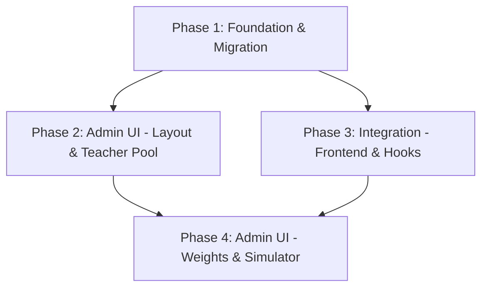

<!-- AGENT_NAV_METADATA -->
<!-- path: docs/maestro/plans/2026-03-25-sammelkarten-admin-suite-impl-plan.md -->
<!-- role: planning -->
<!-- read_mode: conditional -->
<!-- token_hint: summary-first -->
<!-- default_action: read if task touches planning, audits, or rollout decisions -->
<!-- index: docs/AGENT_CONTEXT_INDEX.md -->

# Implementation Plan: Sammelkarten Admin Suite (v1.0.0)

**Status**: Draft
**Date**: 2026-03-25
**Task Complexity**: medium
**Plan Version**: 1.0.0

## 1. Plan Overview
This plan details the transition of the "Sammelkarten" (trading cards) feature from hardcoded configurations to a fully dynamic, admin-controlled system. It involves migrating data to a specialized Firestore document, creating a dedicated admin dashboard, and refactoring the frontend to consume these dynamic settings.

## 2. Dependency Graph


## 3. Execution Strategy Table

| Phase | Description | Agent | Execution Mode | Batch |
|-------|-------------|-------|----------------|-------|
| 1 | Foundation, Types & Migration Logic | `data_engineer` | Sequential | 1 |
| 2 | Admin UI - Layout & Card Manager Base | `coder` | Parallel | 2 |
| 3 | Frontend Integration (Hooks & Opening Page) | `coder` | Parallel | 2 |
| 4 | Advanced Admin Features (Weights & Simulator) | `coder` | Sequential | 3 |

## 4. Phase Details

### Phase 1: Foundation & Migration
**Objective**: Prepare the data structure and migrate existing `loot_teachers` to the new `settings/sammelkarten` document.

- **Agent**: `data_engineer`
- **Files to Create**:
    - `src/types/cards.ts`: Expand existing types to include `SammelkartenConfig`, `RarityWeights`, and `VariantProbabilities`.
- **Files to Modify**:
    - `scripts/migrate_card_settings.ts`: Finalize the script to ensure it correctly maps all existing teachers and initializes weights.
    - `src/lib/firebase.ts`: (Verify) ensure types are exported correctly for the new document.
- **Implementation Details**:
    - Define `SammelkartenConfig` interface:
      ```typescript
      interface SammelkartenConfig {
        loot_teachers: LootTeacher[];
        rarity_weights: { common: number; rare: number; epic: number; mythic: number; legendary: number; };
        godpack_weights: { common: number; rare: number; epic: number; mythic: number; legendary: number; }[];
        variant_probabilities: { shiny: number; holo: number; black_shiny_holo: number; };
        global_limits: { daily_allowance: number; reset_hour: number; };
        updated_at: any;
      }
      ```
    - Execute the migration script locally or via a one-time function trigger.
- **Validation**:
    - Check Firestore for the presence of `settings/sammelkarten` with correct initial data.
    - Run `ts-node scripts/migrate_card_settings.ts` and verify output.

### Phase 2: Admin UI - Layout & Teacher Pool
**Objective**: Create the new `/admin/sammelkarten` route and move the teacher pool management there.

- **Agent**: `coder`
- **Files to Create**:
    - `src/components/auth/AdminGuard.tsx`: Reusable wrapper for admin routes.
    - `src/app/admin/sammelkarten/page.tsx`: Initial dashboard with the migrated Teacher Pool UI.
- **Files to Modify**:
    - `src/app/admin/global-settings/page.tsx`: Remove the "Lehrer-Sammelkarten" section and redirect users to the new page.
    - `src/app/admin/page.tsx`: Add a link to the new Card Manager.
- **Implementation Details**:
    - Implement `AdminGuard` using `useAuth` profile role check.
    - Port the teacher management logic (Add/Edit/Remove/Sync) from `global-settings` to the new page, updating it to use `settings/sammelkarten`.
- **Validation**:
    - Verify access control to `/admin/sammelkarten`.
    - Test adding/removing teachers and syncing rarities in the new UI.

### Phase 3: Integration - Frontend & Hooks
**Objective**: Refactor the live Sammelkarten page and user hooks to use the new dynamic configuration.

- **Agent**: `coder`
- **Files to Modify**:
    - `src/app/sammelkarten/page.tsx`: Update `onSnapshot` to listen to `settings/sammelkarten`. Use dynamic weights in `generatePack`.
    - `src/hooks/useUserTeachers.ts`: Fetch `daily_allowance` and `variant_probabilities` from Firestore instead of using constants.
- **Implementation Details**:
    - Implement fallback defaults in case the Firestore document is partially missing or invalid.
    - Update the "Booster Reset" timer logic to use the `reset_hour` from settings.
- **Validation**:
    - Open a pack on the `/sammelkarten` page and verify it still works correctly.
    - Verify that changing the daily allowance in Firestore (manually for now) updates the UI immediately.

### Phase 4: Admin UI - Weights & Simulator
**Objective**: Implement the Weight Editors and the Pack Simulator in the Admin Suite.

- **Agent**: `coder`
- **Files to Modify**:
    - `src/app/admin/sammelkarten/page.tsx`: Add sections for Rarity Weights, Godpack Weights, and Variant Probabilities. Add the "Pack Simulator" tool.
- **Implementation Details**:
    - Add form controls for all weights with auto-save logic (similar to `global-settings`).
    - Implement a `simulatePacks(count)` function that runs the `generatePack` logic in a loop and aggregates results.
    - Display results in a table with percentage distribution vs. target weights.
- **Validation**:
    - Run the simulator with 1000 packs and verify the distribution matches the configured weights.
    - Change a weight (e.g., Legendary to 10%) and verify the simulator reflects this change.

## 5. File Inventory

| Phase | Action | Path | Purpose |
|-------|--------|------|---------|
| 1 | Create | `src/types/cards.ts` | Shared types for card config |
| 1 | Modify | `scripts/migrate_card_settings.ts` | Data migration logic |
| 2 | Create | `src/components/auth/AdminGuard.tsx` | Route protection |
| 2 | Create | `src/app/admin/sammelkarten/page.tsx` | New Admin Dashboard |
| 2 | Modify | `src/app/admin/global-settings/page.tsx` | Remove legacy UI |
| 2 | Modify | `src/app/admin/page.tsx` | Navigation link |
| 3 | Modify | `src/app/sammelkarten/page.tsx` | Dynamic pack generation |
| 3 | Modify | `src/hooks/useUserTeachers.ts` | Dynamic limits & variants |
| 4 | Modify | `src/app/admin/sammelkarten/page.tsx` | Weights editor & Simulator |

## 6. Risk Classification

| Phase | Risk | Rationale |
|-------|------|-----------|
| 1 | MEDIUM | Migration of live data always carries risk. Backup is essential. |
| 2 | LOW | Purely UI move with existing logic. |
| 3 | HIGH | Modifying the core collection logic could break the game for users. |
| 4 | LOW | Purely administrative tools, no impact on live users until weights are saved. |

## 7. Execution Profile
- Total phases: 4
- Parallelizable phases: 2 (Phases 2 and 3 can run in parallel)
- Sequential-only phases: 2
- Estimated parallel wall time: 3-4 hours
- Estimated sequential wall time: 4-6 hours

## 8. Cost Estimation

| Phase | Agent | Model | Est. Input | Est. Output | Est. Cost |
|-------|-------|-------|-----------|------------|----------|
| 1 | `data_engineer` | Pro | 5K | 1K | $0.09 |
| 2 | `coder` | Pro | 8K | 2K | $0.16 |
| 3 | `coder` | Pro | 10K | 2K | $0.18 |
| 4 | `coder` | Pro | 10K | 3K | $0.22 |
| **Total** | | | **33K** | **8K** | **$0.65** |
