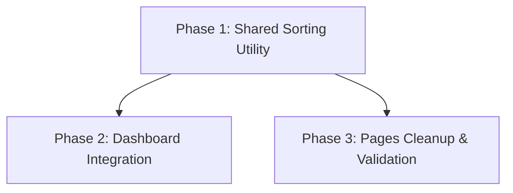

# Implementation Plan: Smarter Todo Sorting and Centralization

**task_complexity: medium**

## 1. Plan Overview
This plan centralizes the "smart" todo sorting logic into the `TodoList` component and refactors existing pages to use this consistent logic.

- **Total Phases:** 3
- **Agents Involved:** `coder`
- **Estimated Effort:** ~3-4 hours

## 2. Dependency Graph

## 3. Execution Strategy Table
| Phase | Objective | Agent | Parallel |
|-------|-----------|-------|----------|
| 1 | Centralize sorting in `TodoList.tsx` | `coder` | No |
| 2 | Refactor Dashboard to use utility | `coder` | Yes (with P3) |
| 3 | Refactor Todos and Groups pages | `coder` | Yes (with P2) |

## 4. Phase Details

### Phase 1: Shared Sorting Utility
- **Objective:** Implement `getRelevanceScore` and recursive `getSortedTodoTree` logic in `TodoList.tsx`.
- **Agent Assignment:** `coder`
- **Files to Modify:**
  - `src/components/dashboard/TodoList.tsx`:
    - Add `getRelevanceScore(todo, user, profile)` helper.
    - Update `displayedTodos` `useMemo` to sort `roots` and `children` using the new scoring logic.
    - Status priority: Active > Done.
    - Relevance priority: Personal (100) > Group (50) > Class (25).
    - Deadline priority: Overdue (40) > <7d (20) > <14d (10).
    - Absolute deadline and creation date as tie-breakers.
- **Validation:**
  - `npm run lint`
  - Manual check: Ensure tree structure (indentation) is preserved.

### Phase 2: Dashboard Integration
- **Objective:** Update `src/app/page.tsx` to remove manual sorting and use the centralized logic.
- **Agent Assignment:** `coder`
- **Files to Modify:**
  - `src/app/page.tsx`:
    - Simplify the `onSnapshot` listener for todos.
    - Remove the local `scoredTodos` and `finalTodos` sorting logic.
    - Pass raw `openTodos` to `TodoList` and rely on its `maxItems={5}` for the dashboard view.
- **Validation:**
  - Verify dashboard "Aufgaben" section shows correctly prioritized items.

### Phase 3: Pages Cleanup & Validation
- **Objective:** Align other pages with the new sorting behavior.
- **Agent Assignment:** `coder`
- **Files to Modify:**
  - `src/app/todos/page.tsx`: Ensure it passes todos to `TodoList` without pre-sorting (currently sorted by `created_at` in query).
  - `src/app/gruppen/page.tsx`: Ensure it passes todos to `TodoList`.
- **Validation:**
  - Verify "All" tab in `/todos` shows correct order.
  - Verify group-specific todos are sorted by relevance/deadline.

## 5. File Inventory
| Phase | Action | Path | Purpose |
|-------|--------|------|---------|
| 1 | Modify | `src/components/dashboard/TodoList.tsx` | Centralized sorting logic |
| 2 | Modify | `src/app/page.tsx` | Dashboard integration |
| 3 | Modify | `src/app/todos/page.tsx` | Main todos page refactor |
| 3 | Modify | `src/app/gruppen/page.tsx` | Groups page refactor |

## 6. Risk Classification
- **Phase 1: MEDIUM.** Risk of breaking the recursive tree structure or indentation.
- **Phase 2: LOW.** Simple refactoring of existing logic.
- **Phase 3: LOW.** UI validation.

## 7. Execution Profile
- Total phases: 3
- Parallelizable phases: 2 (in 1 batch)
- Sequential-only phases: 1

## 8. Cost Estimation
| Phase | Agent | Model | Est. Input | Est. Output | Est. Cost |
|-------|-------|-------|-----------|------------|----------|
| 1 | coder | pro | 3000 | 1000 | $0.07 |
| 2 | coder | pro | 2500 | 500 | $0.045 |
| 3 | coder | pro | 4000 | 800 | $0.072 |
| **Total** | | | **9500** | **2300** | **$0.187** |
