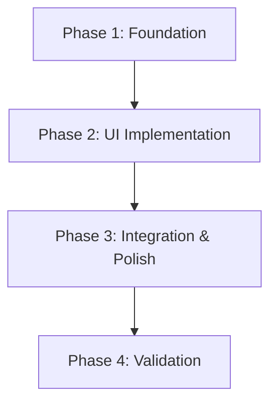

<!-- AGENT_NAV_METADATA -->
<!-- path: docs/maestro/plans/2026-04-01-friend-filtering-ui-impl-plan.md -->
<!-- role: planning -->
<!-- read_mode: conditional -->
<!-- token_hint: summary-first -->
<!-- default_action: read if task touches planning, audits, or rollout decisions -->
<!-- index: docs/AGENT_CONTEXT_INDEX.md -->

# Implementation Plan: Friend Filtering UI

**Date**: 2026-04-01
**Topic**: `friend-filtering-ui`
**Task Complexity**: `medium`
**Design Depth**: `quick`

## 1. Plan Overview
This plan outlines the implementation of a categorical filter (name, class, school) for the friend list in the ABI Planer application. The changes will be localized to the `FriendsPage` component.

## 2. Dependency Graph

## 3. Execution Strategy Table
| Stage | Agent | Mode | Focus |
|-------|-------|------|-------|
| 1 | `architect` | sequential | State & Filtering Logic |
| 2 | `coder` | sequential | UI Components (Filter Bar) |
| 3 | `coder` | sequential | Integration & Refinement |
| 4 | `tester` | sequential | Validation & Edge Cases |

## 4. Phase Details

### Phase 1: Foundation
**Objective**: Define the filtering state and implement the `useMemo` logic for filtering friends.
**Agent**: `architect`
**Files to Modify**:
- `src/app/profil/freunde/page.tsx`: Add `friendSearchTerm`, `selectedClass`, and `selectedSchool` states. Implement `filteredFriendships` memo.

### Phase 2: UI Implementation
**Objective**: Add the filter bar UI to the "friends" section.
**Agent**: `coder`
**Files to Modify**:
- `src/app/profil/freunde/page.tsx`: Insert a filter bar (Input for name, Select/Tabs for Class/School) above the friendship list.

### Phase 3: Integration & Polish
**Objective**: Ensure the filters work together and handle empty states gracefully.
**Agent**: `coder`
**Files to Modify**:
- `src/app/profil/freunde/page.tsx`: Refine the layout, add "Clear Filters" button if needed, and ensure responsiveness.

### Phase 4: Validation
**Objective**: Verify filtering works correctly across all categories.
**Agent**: `tester`
**Validation Criteria**:
- Search by name filters the list correctly.
- Selecting a class filters the list correctly.
- Selecting a school filters the list correctly.
- Empty search results show an appropriate message.
- UI is responsive on mobile.

## 5. File Inventory
| Phase | Action | Path | Purpose |
|-------|--------|------|---------|
| 1-3 | Modify | `src/app/profil/freunde/page.tsx` | Main friend management page |

## 6. Risk Classification
- **MEDIUM**: UI Clutter. Adding many filters might make the "Meine Freunde" section too busy.
- **LOW**: Logic errors. Client-side filtering is straightforward but needs to handle undefined fields safely.

## 7. Execution Profile
- Total phases: 4
- Parallelizable phases: 0 (all in one file)
- Sequential-only phases: 4
- Estimated wall time: 4 turns

## 8. Cost Estimation
| Phase | Agent | Model | Est. Input | Est. Output | Est. Cost |
|-------|-------|-------|-----------|------------|----------|
| 1 | `architect` | Pro | 5000 | 500 | $0.07 |
| 2 | `coder` | Pro | 6000 | 1000 | $0.10 |
| 3 | `coder` | Pro | 7000 | 1000 | $0.11 |
| 4 | `tester` | Pro | 8000 | 500 | $0.10 |
| **Total** | | | **26000** | **3000** | **$0.38** |
