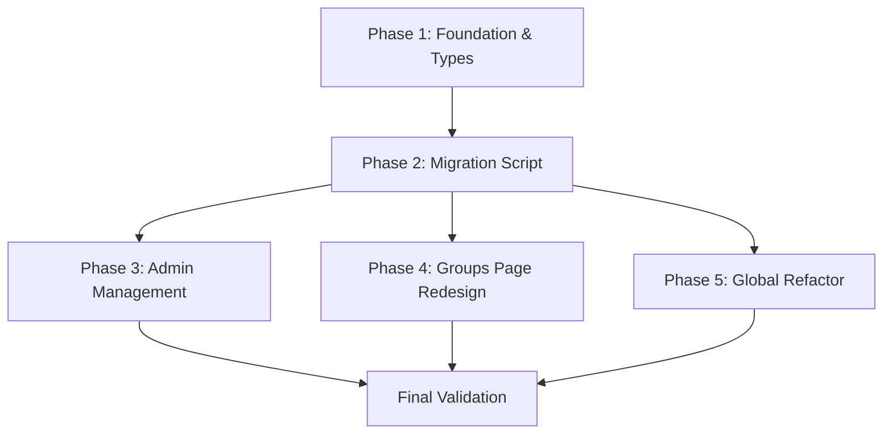

<!-- AGENT_NAV_METADATA -->
<!-- path: docs/maestro/plans/2026-04-01-hierarchical-groups-impl-plan.md -->
<!-- role: planning -->
<!-- read_mode: conditional -->
<!-- token_hint: summary-first -->
<!-- default_action: read if task touches planning, audits, or rollout decisions -->
<!-- index: docs/AGENT_CONTEXT_INDEX.md -->

# Implementation Plan: Hierarchical Groups & Multiple Memberships

**Task Complexity**: Medium
**Project**: ABI Planer

## 1. Plan Overview
Transition the flat group system to a hierarchical structure with two main parents ("Ballplanung", "FinanzTeam") and allow users to join multiple groups. This requires schema updates, a data migration, and a UI overhaul.

- **Total Phases**: 5
- **Agents Involved**: `architect`, `data_engineer`, `coder`, `tester`
- **Estimated Effort**: Medium

## 2. Dependency Graph

## 3. Execution Strategy Table

| Stage | Batch | Phases | Execution Mode | Agent(s) |
|-------|-------|--------|----------------|----------|
| 1 | 1 | 1 | Sequential | `architect` |
| 2 | 2 | 2 | Sequential | `data_engineer` |
| 3 | 3 | 3, 4 | Parallel | `coder`, `ux_designer` |
| 4 | 4 | 5 | Sequential | `coder` |
| 5 | 5 | 6 | Sequential | `tester` |

## 4. Phase Details

### Phase 1: Foundation & Types
**Objective**: Update core data types and security rules to support arrays for groups and hierarchy for teams.

- **Agent**: `architect`
- **Files to Modify**:
    - `src/types/database.ts`: Update `PlanningGroup` (add `parent_name`, `is_parent`) and `Profile` (add `planning_groups: string[]`, `led_groups: string[]`).
    - `firestore.rules`: Update `isGroupLeader` helper and profile/message rules to use array membership (`in` or `array-contains`).
- **Validation**:
    - Build check: `npm run build` (to catch type errors).
    - Firestore rules syntax check (if possible) or manual review.

### Phase 2: Migration Script
**Objective**: Migrate all existing profile data and settings to the new hierarchical and array-based format.

- **Agent**: `data_engineer`
- **Files to Create**:
    - `scripts/migrate_to_hierarchical_groups.ts`: Script using Firebase Admin SDK to transform data.
- **Implementation Details**:
    - Update `settings/config`: Mark "Ballplanung" and "FinanzTeam" as parents.
    - Transform `Profile.planning_group` -> `Profile.planning_groups` (as `[planning_group]`).
    - Sync `Profile.led_groups` based on `Settings.planning_groups.leader_user_id`.
- **Validation**:
    - Run script in dry-run mode first.
    - Verify a few sample profiles in Firebase Console.

### Phase 3: Admin Management
**Objective**: Enable admins to manage the group hierarchy and leaders in the Settings page.

- **Agent**: `coder`
- **Files to Modify**:
    - `src/app/einstellungen/page.tsx`: Add parent group selection and ensure leader changes sync to `led_groups` in profiles.
- **Validation**:
    - Create a new group, assign a parent, and verify it saves correctly in `settings/config`.
    - Change a group leader and verify the user's `led_groups` array is updated.

### Phase 4: Groups Page Redesign
**Objective**: Redesign the Groups page to display the hierarchy and support multiple memberships.

- **Agent**: `coder`
- **Files to Modify**:
    - `src/app/gruppen/page.tsx`: Group by parent, update "Mein Team" tab, and modify member add/remove logic for arrays.
    - `src/components/groups/GroupCard.tsx`: Support hierarchical context.
    - `src/components/groups/MemberItem.tsx`: Handle multiple group contexts.
- **Validation**:
    - Verify "Mein Team" shows all groups a user is in.
    - Verify subgroups are correctly nested under their parents.

### Phase 5: Global Refactor
**Objective**: Update all other components that rely on `planning_group` to work with the new `planning_groups` array.

- **Agent**: `coder`
- **Files to Modify**:
    - `src/components/dashboard/TodoList.tsx`: Filter todos by *any* of the user's groups.
    - `src/components/dashboard/CalendarEvents.tsx`: Similar update for events.
    - `src/components/modals/AddTodoDialog.tsx`: Show hierarchical group selection.
    - `src/components/layout/Navbar.tsx`: Update group links.
    - `src/hooks/useNotifications.ts`: Update group-based notification logic.
- **Validation**:
    - Create a todo for Group A, be in Group A and B, and ensure the todo appears on the dashboard.
    - Full regression test of communication features (GroupWall).

## 5. File Inventory

| Phase | Action | Path | Purpose |
|-------|--------|------|---------|
| 1 | Modify | `src/types/database.ts` | Schema update |
| 1 | Modify | `firestore.rules` | Security update |
| 2 | Create | `scripts/migrate_groups.ts` | Data transformation |
| 3 | Modify | `src/app/einstellungen/page.tsx` | Admin UI update |
| 4 | Modify | `src/app/gruppen/page.tsx` | Groups UI redesign |
| 4 | Modify | `src/components/groups/GroupCard.tsx` | UI component update |
| 5 | Modify | `src/components/dashboard/TodoList.tsx` | Multi-group support |
| 5 | Modify | `src/components/modals/AddTodoDialog.tsx` | UI component update |

## 6. Risk Classification

- **Phase 1**: LOW - Type changes are safe but broad.
- **Phase 2**: HIGH - Data migration affects all users.
- **Phase 3**: MEDIUM - Admin logic must be robust to avoid sync issues.
- **Phase 4**: MEDIUM - Complex UI changes.
- **Phase 5**: MEDIUM - High volume of small changes across many files.

## 7. Execution Profile

- **Total phases**: 5
- **Parallelizable phases**: 2 (Phase 3 and 4 in Batch 3)
- **Sequential-only phases**: 3
- **Estimated parallel wall time**: ~4 hours
- **Estimated sequential wall time**: ~6 hours

Note: Native parallel execution currently runs agents in autonomous mode.
All tool calls are auto-approved without user confirmation.
