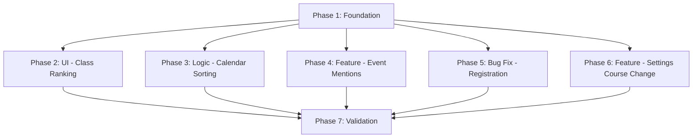

# Implementation Plan: ABI Planer Fixes & Features

## 1. Plan Overview
This plan addresses UI fixes for the Class Ranking component, logic updates for calendar sorting, adding event mentions, fixing registration flow bugs, and adding course change functionality in user settings.

- **Total Phases**: 7
- **Agents Involved**: `architect`, `coder`, `tester`, `data_engineer`
- **Estimated Effort**: Medium/High

## 2. Dependency Graph

## 3. Execution Strategy Table
| Stage | Phases | Agent(s) | Execution Mode |
|-------|--------|----------|----------------|
| Foundation | 1 | `data_engineer` | Sequential |
| Implementation | 2, 3, 4, 5, 6 | `coder` | Parallel (where possible) |
| Quality | 7 | `tester` | Sequential |

## 4. Phase Details

### Phase 1: Foundation (Types & Schema)
- **Objective**: Update the data structures to support mentions and ensured consistent course handling.
- **Agent**: `data_engineer`
- **Files to Modify**:
  - `src/types/database.ts`: Update `Event` interface with `mentioned_user_ids: string[]`, `mentioned_roles: string[]`, `mentioned_groups: string[]`.
- **Validation**: `npm run lint`

### Phase 2: UI - Class Ranking (Kurswettstreit)
- **Objective**: Rename 'Kurswettstreit' to 'Kurs-Ranking' and fix UI clipping.
- **Agent**: `coder`
- **Files to Modify**:
  - `src/components/dashboard/ClassLeaderboard.tsx`: Rename to `ClassRanking.tsx` (and component name). Update title and icons. Fix clipping in "Wettstreit-Tipp" by adjusting `line-clamp` or container overflow.
  - `src/app/page.tsx`: Update import for `ClassRanking`.
- **Validation**: Manual visual check, `npm run lint`

### Phase 3: Logic - Calendar Sorting
- **Objective**: Sort events: Upcoming (asc), Past (desc) at the bottom.
- **Agent**: `coder`
- **Files to Modify**:
  - `src/components/dashboard/CalendarEvents.tsx`: Update sorting logic for the dashboard view.
  - `src/app/kalender/page.tsx`: Update the query and/or client-side sort to separate upcoming and past events.
- **Validation**: Check sorting in dashboard and calendar pages.

### Phase 4: Feature - Event Mentions
- **Objective**: Implement mentions for people, roles, and groups in events.
- **Agent**: `coder`
- **Files to Modify**:
  - `src/components/modals/AddEventDialog.tsx`: Add search/select UI for mentions.
  - `src/components/modals/EditEventDialog.tsx`: Add search/select UI for mentions.
  - `src/components/modals/CalendarEventDetailsDialog.tsx`: Display mentions as chips/badges.
- **Validation**: Create an event with mentions and verify they display correctly.

### Phase 5: Bug Fix - Registration Flow
- **Objective**: Fix registration Step 3 (course selection) being skipped.
- **Agent**: `coder`
- **Files to Modify**:
  - `src/app/register/page.tsx`: Investigate `validateCurrentStep` logic. Ensure Step 3 correctly validates `class_name` and uses defaults if Firestore is empty.
- **Validation**: Perform a full registration flow and ensure Step 3 is shown and required.

### Phase 6: Feature - Settings Course Change
- **Objective**: Allow students to change their course in their profile settings.
- **Agent**: `coder`
- **Files to Modify**:
  - `src/app/profil/page.tsx`: Add a course selection dropdown using the global `courses` list.
  - `src/components/modals/EditSettingsDialog.tsx`: If applicable, expand or add a profile-specific update modal.
- **Validation**: Change course in profile and verify it updates in Firestore and the leaderboard.

### Phase 7: Validation & Cleanup
- **Objective**: Final project validation.
- **Agent**: `tester`
- **Validation**: `npm run lint`, `npm run build`.

## 5. File Inventory
| Phase | Action | Path | Purpose |
|-------|--------|------|---------|
| 1 | Modify | `src/types/database.ts` | Expand `Event` type |
| 2 | Rename | `src/components/dashboard/ClassLeaderboard.tsx` -> `ClassRanking.tsx` | Rename and fix UI |
| 2 | Modify | `src/app/page.tsx` | Update component import |
| 3 | Modify | `src/components/dashboard/CalendarEvents.tsx` | Update sorting logic |
| 3 | Modify | `src/app/kalender/page.tsx` | Update sorting logic |
| 4 | Modify | `src/components/modals/AddEventDialog.tsx` | Add mentions UI |
| 4 | Modify | `src/components/modals/EditEventDialog.tsx` | Add mentions UI |
| 4 | Modify | `src/components/modals/CalendarEventDetailsDialog.tsx` | Display mentions |
| 5 | Modify | `src/app/register/page.tsx` | Fix registration logic |
| 6 | Modify | `src/app/profil/page.tsx` | Add course change |

## 6. Risk Classification
| Phase | Risk | Rationale |
|-------|------|-----------|
| 1 | LOW | Type-only change. |
| 2 | LOW | Purely UI renaming and CSS fix. |
| 3 | MEDIUM | Complexity in upcoming/past split logic. |
| 4 | MEDIUM | Complex UI for multi-select search. |
| 5 | HIGH | Critical for user onboarding. |
| 6 | LOW | Standard profile update. |

## 7. Execution Profile
- **Total phases**: 7
- **Parallelizable phases**: 2, 3, 4, 5, 6 (Batch 1 after Phase 1)
- **Sequential-only phases**: 1, 7
- **Estimated parallel wall time**: 3-4 hours
- **Estimated sequential wall time**: 6-8 hours

| Phase | Agent | Model | Est. Input | Est. Output | Est. Cost |
|-------|-------|-------|-----------|------------|----------|
| 1 | `data_engineer` | Flash | 2000 | 500 | $0.01 |
| 2 | `coder` | Pro | 5000 | 1000 | $0.10 |
| 3 | `coder` | Pro | 5000 | 1000 | $0.10 |
| 4 | `coder` | Pro | 8000 | 2000 | $0.20 |
| 5 | `coder` | Pro | 5000 | 1000 | $0.10 |
| 6 | `coder` | Pro | 5000 | 1000 | $0.10 |
| 7 | `tester` | Flash | 5000 | 500 | $0.01 |
| **Total** | | | | | **$0.62** |
