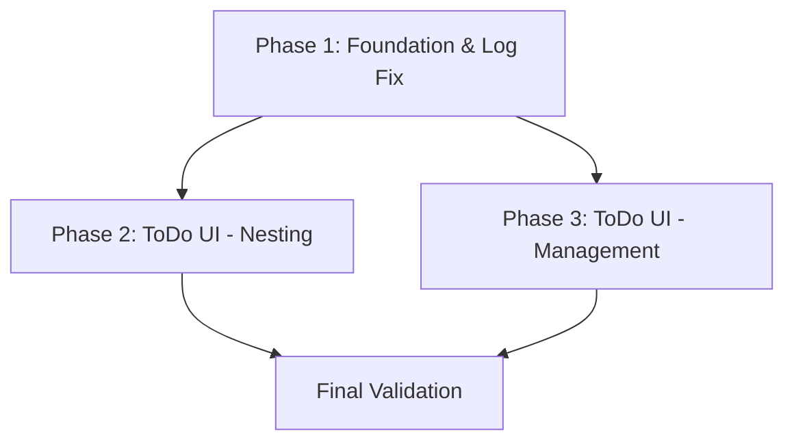

# Implementation Plan: ToDo Sub-tasks & Log Spam Fix

**Date:** 2026-03-20
**Task Complexity:** Medium
**Design Document:** [2026-03-20-todo-subtasks-and-log-fix-design.md](./2026-03-20-todo-subtasks-and-log-fix-design.md)

## 1. Plan Overview
This plan addresses the log spam in `FundingStatus.tsx` and implements recursively nested sub-tasks for the ToDo system. It consists of 3 phases.

- **Total Phases:** 3
- **Agents:** `coder` (Primary)
- **Estimated Effort:** Moderate

## 2. Dependency Graph

## 3. Execution Strategy Table
| Phase | Agent | Mode | Objective |
|-------|-------|------|-----------|
| 1 | `coder` | Sequential | Update data model and fix log spam |
| 2 | `coder` | Sequential | Implement indented rendering for sub-tasks |
| 3 | `coder` | Sequential | Implement sub-task creation and cascading deletes |

## 4. Phase Details

### Phase 1: Foundation & Log Fix
- **Objective:** Update the `Todo` data model and fix the redundant logging in `FundingStatus.tsx`.
- **Agent:** `coder`
- **Files to Modify:**
    - `src/types/database.ts`: Add `parentId?: string | null;` to the `Todo` interface.
    - `src/components/dashboard/FundingStatus.tsx`: Add a check to only call `onTicketSalesChange` if the value has changed from `initialTicketSales`.
- **Validation:**
    - `npm run lint`
    - Verify that refreshing the dashboard doesn't trigger a `logAction` (mocked or manual check).
- **Dependencies:** None

### Phase 2: ToDo UI - Nesting
- **Objective:** Implement the UI logic to display tasks in an indented tree structure.
- **Agent:** `coder`
- **Files to Modify:**
    - `src/components/dashboard/TodoList.tsx`: 
        - Update rendering to group tasks by `parentId`.
        - Implement recursive or iterative tree rendering with indentation (e.g., `pl-4` per level).
- **Validation:**
    - `npm run check`
    - Manually verify that tasks with a `parentId` are rendered under their parents with indentation.
- **Dependencies:** `blocked_by: [1]`

### Phase 3: ToDo UI - Management
- **Objective:** Enable sub-task creation and implement cascading deletes.
- **Agent:** `coder`
- **Files to Modify:**
    - `src/modals/AddTodoDialog.tsx`: 
        - Accept `parentId` as a prop.
        - Include `parentId` in the Firestore `addDoc` call.
    - `src/components/dashboard/TodoList.tsx`:
        - Add a "Add Sub-task" button to each task (triggers `AddTodoDialog` with `parentId`).
        - Update `handleDelete` to recursively delete all sub-tasks (descendants) from Firestore.
- **Validation:**
    - `npm run check`
    - Verify sub-task creation works.
    - Verify that deleting a parent task also deletes its sub-tasks.
- **Dependencies:** `blocked_by: [1, 2]`

## 5. File Inventory
| Phase | Action | Path | Purpose |
|-------|--------|------|---------|
| 1 | Modify | `src/types/database.ts` | Add `parentId` field |
| 1 | Modify | `src/components/dashboard/FundingStatus.tsx` | Fix log spam |
| 2 | Modify | `src/components/dashboard/TodoList.tsx` | Tree rendering |
| 3 | Modify | `src/components/dashboard/TodoList.tsx` | Cascading deletes & UI buttons |
| 3 | Modify | `src/modals/AddTodoDialog.tsx` | Support `parentId` |

## 6. Risk Classification
- **Phase 1:** LOW. Simple field addition and logic fix.
- **Phase 2:** MEDIUM. Tree rendering logic can be tricky and affect layout.
- **Phase 3:** MEDIUM. Cascading deletes involve multiple Firestore operations.

## 7. Execution Profile
- Total phases: 3
- Parallelizable phases: 0 (Phases 2 and 3 both modify `TodoList.tsx`)
- Sequential-only phases: 3

## 8. Cost Estimation
| Phase | Agent | Model | Est. Input | Est. Output | Est. Cost |
|-------|-------|-------|-----------|------------|----------|
| 1 | `coder` | Pro | 5K | 1K | $0.09 |
| 2 | `coder` | Pro | 8K | 2K | $0.16 |
| 3 | `coder` | Pro | 10K | 3K | $0.22 |
| **Total** | | | **23K** | **6K** | **$0.47** |
