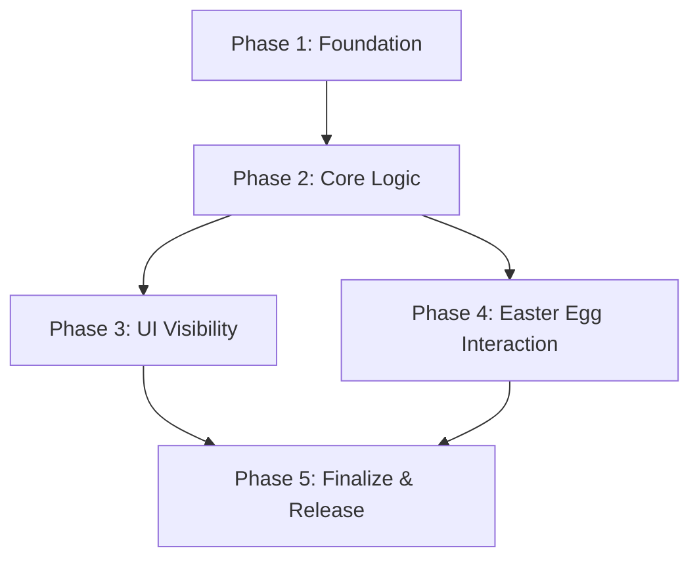

# Implementation Plan: Sammelkarten Feature Release & Version-Button Easter Egg (v0.21.00)

## Plan Overview
This plan details the steps to transition the "Sammelkarten" feature to a permanent state, implement a new interaction-based booster reward in the Footer, and finalize the `v0.21.00` release.

## Dependency Graph

## Execution Strategy Table
| Stage | Description | Agent | Execution Mode |
|-------|-------------|-------|----------------|
| 1 | Foundation: Types & Versioning | `coder` | Sequential |
| 2 | Core Logic: Booster Hook Updates | `coder` | Sequential |
| 3 | UI Visibility: Navbar, Settings, Pages | `coder` | Parallel (with P4) |
| 4 | UI Interaction: Footer Reward | `coder` | Parallel (with P3) |
| 5 | Finalize: Sync, Changelog, Verification | `technical_writer` | Sequential |

## Phase Details

### Phase 1: Foundation (Types & Versioning)
**Objective**: Update data models and set the initial version for release.

- **Agent**: `coder`
- **Files to Modify**:
    - `src/types/database.ts`: Update `Profile` to include `extra_available` and `extra_boosters_claimed` in `booster_stats`.
    - `VERSION`: Update to `v0.21.00`.
- **Validation**:
    - `npm run lint` to ensure type safety.

### Phase 2: Core Logic (Booster Hook Updates)
**Objective**: Implement the reward claim logic and update booster consumption to account for extra boosters.

- **Agent**: `coder`
- **Files to Modify**:
    - `src/hooks/useUserTeachers.ts`:
        - Add `claimExtraBoosters` function (transaction-safe).
        - Update `collectBooster` and `collectTeacher` to use `extra_available` when the daily limit (2) is reached.
        - Update `getRemainingBoosters` to include `extra_available`.
- **Validation**:
    - Manual verification of the transaction logic.
    - Check if daily limit still works but allows overflow if `extra_available > 0`.

### Phase 3: UI Visibility (Navbar, Settings, Pages)
**Objective**: Make the feature permanent and remove legacy "hidden" state UI.

- **Agent**: `coder`
- **Files to Modify**:
    - `src/components/layout/Navbar.tsx`: Always show Sammelkarten menu items.
    - `src/app/einstellungen/page.tsx`: Remove the Sammelkarten visibility toggle card.
    - `src/app/sammelkarten/page.tsx`: Remove the `redirect('/')` if `!easter_egg_unlocked`.
- **Validation**:
    - Verify Sammelkarten link is visible in Navbar for all users.
    - Verify `/sammelkarten` is accessible directly.
    - Verify Settings page no longer has the toggle.

### Phase 4: UI Interaction (Footer Reward)
**Objective**: Implement the 3-click version button reward.

- **Agent**: `coder`
- **Files to Modify**:
    - `src/components/layout/Footer.tsx`:
        - Update `handleVersionClick` to track 3 clicks.
        - Call `claimExtraBoosters` on the 3rd click.
        - Show "annoyed" toast messages and final "leave me alone" toast.
        - Check `profile.booster_stats?.extra_boosters_claimed` to prevent re-claiming.
- **Validation**:
    - Click version button 3 times -> Verify 5 boosters added.
    - Verify toast messages appear correctly.
    - Verify reward cannot be claimed twice.

### Phase 5: Finalize & Release
**Objective**: Sync version across files, update changelog, and perform final check.

- **Agent**: `technical_writer`
- **Files to Modify**:
    - `CHANGELOG.md`: Add release notes for `v0.21.00`.
- **Run Commands**:
    - `node scripts/sync-version.mjs`: Sync `package.json` with `VERSION`.
- **Validation**:
    - Check `package.json` version.
    - Final UI check of all modified components.

## File Inventory
| Phase | Action | Path | Purpose |
|-------|--------|------|---------|
| 1 | Modify | `src/types/database.ts` | Add reward flags to Profile type. |
| 1 | Modify | `VERSION` | Set release version. |
| 2 | Modify | `src/hooks/useUserTeachers.ts` | Implement reward logic and booster overflow. |
| 3 | Modify | `src/components/layout/Navbar.tsx` | Permanent feature visibility. |
| 3 | Modify | `src/app/einstellungen/page.tsx` | Remove legacy toggle. |
| 3 | Modify | `src/app/sammelkarten/page.tsx` | Remove access restriction. |
| 4 | Modify | `src/components/layout/Footer.tsx` | Interactive reward implementation. |
| 5 | Modify | `CHANGELOG.md` | Release documentation. |

## Risk Classification
- **Phase 2 (MEDIUM)**: Transaction logic for boosters must be precise to avoid data corruption.
- **Phase 4 (LOW)**: UI-only interaction, low risk.
- **Phase 3 (LOW)**: Simple visibility removal.

## Cost Estimation
| Phase | Agent | Model | Est. Input | Est. Output | Est. Cost |
|-------|-------|-------|-----------|------------|----------|
| 1 | coder | Pro | 2,000 | 500 | $0.04 |
| 2 | coder | Pro | 3,000 | 1,500 | $0.09 |
| 3 | coder | Pro | 4,000 | 1,500 | $0.10 |
| 4 | coder | Pro | 3,000 | 1,000 | $0.07 |
| 5 | tech_writer | Flash | 2,000 | 500 | $0.01 |
| **Total** | | | **14,000** | **5,000** | **$0.31** |

Execution Profile:
- Total phases: 5
- Parallelizable phases: 2 (Phase 3 & 4)
- Sequential-only phases: 3
- Estimated parallel wall time: 4 agent turns
- Estimated sequential wall time: 6 agent turns
