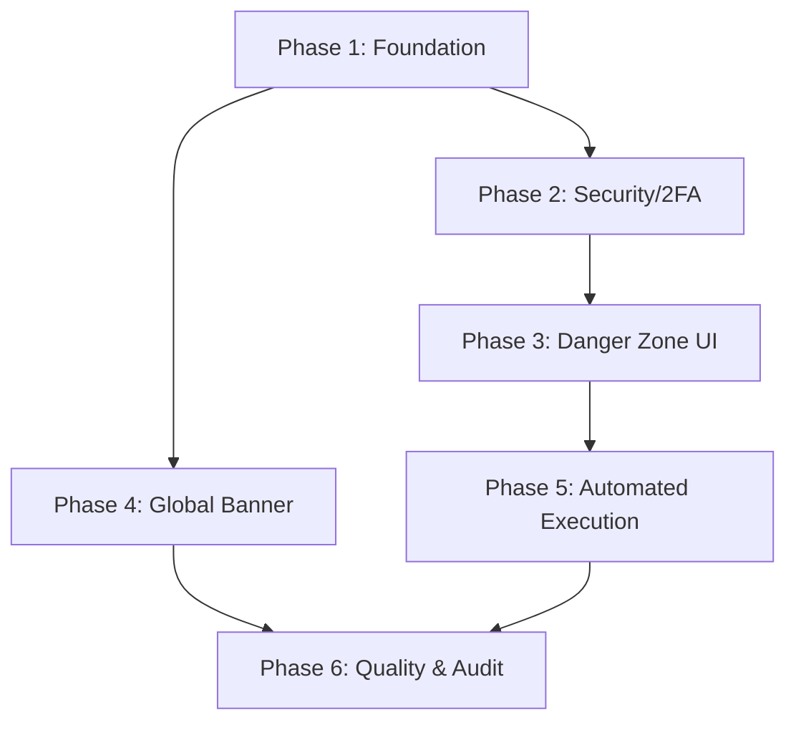

# Implementation Plan: Super Danger Settings Area

**Objective**: Implement a secure, extensible framework for high-risk administrative actions with 2FA (TOTP), a 24-hour delay, automated execution via Firebase Functions, and a global countdown banner for all users.

---

## 1. Plan Overview
- **Total Phases**: 6
- **Agents Involved**: `coder`, `devops_engineer`, `api_designer`, `tester`
- **Estimated Effort**: High (Multi-day implementation)
- **Task Complexity**: Complex

---

## 2. Dependency Graph

---

## 3. Execution Strategy Table
| Stage | Description | Agent | Parallel? |
|-------|-------------|-------|-----------|
| 1 | Foundation (Types & Functions Setup) | `devops_engineer` | No |
| 2 | Security (TOTP Setup & Secret Storage) | `coder` | Yes (with P4) |
| 3 | Danger Zone UI (Action Submission) | `api_designer` | No |
| 4 | Transparency (Global Alert Banner) | `coder` | Yes (with P2) |
| 5 | Automated Execution (Functions Cron) | `coder` | No |
| 6 | Quality & Audit (Logs & Testing) | `tester` | No |

---

## 4. Phase Details

### Phase 1: Foundation (Types & Config)
- **Objective**: Set up the data models and initialize the Firebase Functions environment.
- **Agent**: `devops_engineer`
- **Files to Create**:
    - `functions/package.json`: Dependencies (`firebase-functions`, `firebase-admin`, `otplib`, `qrcode`).
    - `functions/src/index.ts`: Entry point for Cloud Functions.
    - `functions/tsconfig.json`: Typescript config for functions.
- **Files to Modify**:
    - `src/types/database.ts`: Add `DelayedAction`, `UserSecret` types, and `is_2fa_enabled` to `Profile`.
    - `firebase.json`: Add `functions` configuration.
- **Validation**: `cd functions && npm install && npm run build`.

### Phase 2: Security (TOTP Setup & Storage)
- **Objective**: Implement the UI and backend logic for admins to enable 2FA and store the TOTP secret securely.
- **Agent**: `coder`
- **Files to Create**:
    - `src/components/admin/TOTPSetup.tsx`: UI to generate QR code and verify initial TOTP setup.
    - `functions/src/mfa.ts`: `setup2FA` (Callable) and `verify2FA` (Internal logic).
- **Files to Modify**:
    - `src/app/admin/profile/page.tsx` (or similar): Integrate `TOTPSetup`.
    - `firestore.rules`: Restrict `user_secrets` collection (only accessible via Admin SDK/Functions).
- **Validation**: Admin can generate a QR code, scan it in an app, and verify the first code to enable 2FA.

### Phase 3: Danger Zone UI (Action Submission)
- **Objective**: Create the admin interface to select danger actions and submit them for the 24h queue.
- **Agent**: `api_designer`
- **Files to Create**:
    - `src/app/admin/danger/page.tsx`: Main Danger Zone UI.
    - `functions/src/danger.ts`: `authorizeDangerAction` (Callable).
- **Files to Modify**:
    - `src/components/layout/Navbar.tsx`: Add link to the Danger Zone (for `admin_main` only).
- **Validation**: Action selection -> Text input "DELETE" -> 2FA Code -> Successful creation of a document in `delayed_actions`.

### Phase 4: Transparency (Global Alert Banner)
- **Objective**: Implement the global banner that notifies all users of pending data wipes.
- **Agent**: `coder`
- **Files to Create**:
    - `src/components/layout/DangerAlertBanner.tsx`: Sticky banner with countdown timer.
- **Files to Modify**:
    - `src/components/layout/AppShell.tsx`: Integrate the banner above the main content.
- **Validation**: When a doc exists in `delayed_actions` with status `pending`, all users see the banner with a ticking countdown.

### Phase 5: Automated Execution (Functions Cron)
- **Objective**: Implement the scheduled function that executes tasks after the 24h window.
- **Agent**: `coder`
- **Files to Create**:
    - `functions/src/cron.ts`: `executeDangerActions` (Scheduled function).
    - `functions/src/actions/wipeAllCards.ts`: Logic to delete all teacher cards.
    - `functions/src/actions/wipeUserCards.ts`: Logic to delete cards for a specific UID.
- **Validation**: Manually trigger the cron or set a short delay (e.g., 1 min) to verify that cards are actually deleted from Firestore.

### Phase 6: Quality & Audit (Logs & Testing)
- **Objective**: Finalize audit logs and ensure admins can cancel pending actions.
- **Agent**: `tester`
- **Files to Modify**:
    - `src/app/admin/danger/page.tsx`: Add a "Cancel Pending Action" button.
    - `src/lib/logging.ts`: Ensure all danger events are logged.
- **Validation**: Full end-to-end test (Trigger -> Wait/Banner -> Cancel) and (Trigger -> Wait -> Execute).

---

## 5. File Inventory
| Phase | Action | Path | Purpose |
|-------|--------|------|---------|
| 1 | Create | `functions/package.json` | Cloud Functions dependencies. |
| 1 | Modify | `src/types/database.ts` | New types for danger actions. |
| 2 | Create | `src/components/admin/TOTPSetup.tsx` | 2FA Setup UI. |
| 3 | Create | `src/app/admin/danger/page.tsx` | Danger Zone Control Panel. |
| 4 | Create | `src/components/layout/DangerAlertBanner.tsx` | Global countdown banner. |
| 5 | Create | `functions/src/cron.ts` | Automated execution trigger. |

---

## 6. Risk Classification
- **Phase 2 (2FA)**: **MEDIUM**. If TOTP setup is buggy, admins could be locked out of danger actions.
- **Phase 5 (Execution)**: **HIGH**. The core logic for deleting data must be bulletproof. A bug here could wipe more than intended.

---

## 7. Execution Profile
- **Total phases**: 6
- **Parallelizable phases**: 2 (P2 and P4)
- **Sequential-only phases**: 4
- **Estimated parallel wall time**: 4-5 turns per phase.
- **Estimated sequential wall time**: 6 phases * 5 turns = 30 turns.

---

## 8. Cost Estimation
| Phase | Agent | Model | Est. Input | Est. Output | Est. Cost |
|-------|-------|-------|-----------|------------|----------|
| 1 | `devops_engineer` | Pro | 10K | 2K | $0.18 |
| 2 | `coder` | Pro | 15K | 4K | $0.31 |
| 3 | `api_designer` | Pro | 15K | 4K | $0.31 |
| 4 | `coder` | Pro | 12K | 3K | $0.24 |
| 5 | `coder` | Pro | 20K | 5K | $0.40 |
| 6 | `tester` | Pro | 10K | 2K | $0.18 |
| **Total** | | | **82K** | **20K** | **$1.62** |
