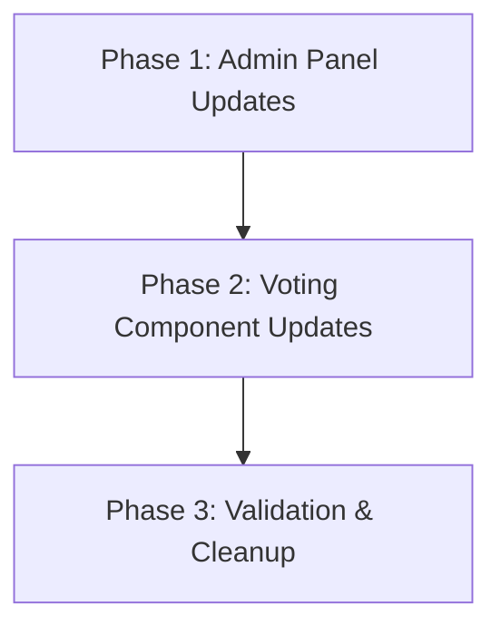

# Implementation Plan: Teacher Rarity Voting Overhaul

**Status**: Draft
**Date**: 2026-03-22
**Task Complexity**: Medium

## 1. Plan Overview
This plan unifies the teacher voting pool with the global settings' `loot_teachers` array. It ensures a single source of truth for teacher management and enables immediate voting for new teachers.

- **Total Phases**: 3
- **Agents Involved**: `coder`, `tester`
- **Estimated Effort**: ~4-6 turns

## 2. Dependency Graph

## 3. Execution Strategy Table

| Phase | Description | Agent | Execution Mode |
|-------|-------------|-------|----------------|
| 1 | Update Admin panel for teacher initialization | `coder` | Sequential |
| 2 | Modify voting component to use settings pool | `coder` | Sequential |
| 3 | Validate end-to-end flow and sync logic | `tester` | Sequential |

## 4. Phase Details

### Phase 1: Admin Panel Updates
**Objective**: Ensure that adding or importing teachers in the Admin panel updates both the `settings/global` document and the `teachers` collection.

- **Agent**: `coder`
- **Files to Modify**:
    - `src/app/admin/global-settings/page.tsx`: 
        - Update `handleAddTeacher` to use `setDoc` to initialize a document in the `teachers` collection with `{ avg_rating: 0, vote_count: 0 }`.
        - Update `handleBulkImport` to also add the imported teachers to the `settings.loot_teachers` array (defaulting to 'common' rarity) to make them immediately available for voting.

**Implementation Details**:
- Use `writeBatch` in `handleBulkImport` to update both `settings/global` and multiple `teachers` documents efficiently.
- Ensure the teacher `id` generation is consistent across both pools.

**Validation Criteria**:
- Adding a teacher manually in Admin UI creates a `teachers` collection document.
- Bulk importing teachers updates the `loot_teachers` list in the Admin UI.

### Phase 2: Voting Component Updates
**Objective**: Change the source of candidates for the rarity poll to the `loot_teachers` array in global settings.

- **Agent**: `coder`
- **Files to Modify**:
    - `src/components/dashboard/TeacherRarityVoting.tsx`:
        - Fetch `settings/global` document using `getDoc` or `onSnapshot`.
        - Use the `loot_teachers` IDs as the basis for the voting pool.
        - Fetch matching documents from the `teachers` collection.
        - Update `handleVote` to use `setDoc(..., { merge: true })` for robustness against uninitialized documents.

**Implementation Details**:
- Maintain the current "random selection" logic but apply it to the filtered pool from settings.
- Ensure the user's `profile.rated_teachers` still correctly filters out teachers they've already voted on.

**Validation Criteria**:
- The component only shows teachers that are present in the Global Settings.
- Casting a vote correctly updates the `teachers` aggregate data.

### Phase 3: Validation & Cleanup
**Objective**: Verify the entire workflow and ensure no regressions in existing features like "Rarity Sync".

- **Agent**: `tester`
- **Files to Verify**:
    - `src/app/admin/global-settings/page.tsx`
    - `src/components/dashboard/TeacherRarityVoting.tsx`
    - `src/components/dashboard/TeacherAlbum.tsx` (ensure it still correctly displays teachers from settings)

**Validation Criteria**:
- End-to-end test: Add teacher -> Vote -> Sync Rarity.
- Verify that removing a teacher from settings makes them disappear from the voting UI immediately.

## 5. File Inventory

| Phase | File Path | Action | Purpose |
|-------|-----------|--------|---------|
| 1 | `src/app/admin/global-settings/page.tsx` | Modify | Synchronize teacher additions with the voting pool. |
| 2 | `src/components/dashboard/TeacherRarityVoting.tsx` | Modify | Source voting candidates from global settings. |

## 6. Risk Classification

| Phase | Risk | Rationale |
|-------|------|-----------|
| 1 | MEDIUM | Risk of desync if batch writes fail or if IDs are not handled consistently. |
| 2 | LOW | Purely UI logic change; existing voting data is preserved. |
| 3 | LOW | Standard verification. |

## 7. Execution Profile
- Total phases: 3
- Parallelizable phases: 0
- Sequential-only phases: 3
- Estimated sequential wall time: 4-6 turns

## 8. Cost Estimation

| Phase | Agent | Model | Est. Input | Est. Output | Est. Cost |
|-------|-------|-------|-----------|------------|----------|
| 1 | `coder` | Pro | 2,500 | 800 | $0.057 |
| 2 | `coder` | Pro | 2,500 | 800 | $0.057 |
| 3 | `tester` | Pro | 2,000 | 400 | $0.036 |
| **Total** | | | **7,000** | **2,000** | **$0.15** |
