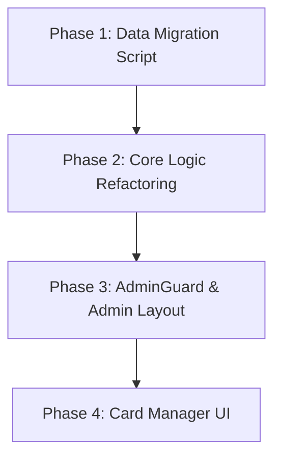

# Implementation Plan: Card Manager

## 1. Plan Overview
- **Total Phases**: 4
- **Agents Involved**: `data_engineer`, `coder`
- **Estimated Effort**: High

## 2. Dependency Graph

## 3. Execution Strategy

| Phase | Agent | Model | Est. Input | Est. Output | Est. Cost | Mode |
|-------|-------|-------|-----------|------------|----------|------|
| 1 | `data_engineer` | Default | 2000 | 500 | $0.04 | Sequential |
| 2 | `coder` | Default | 4000 | 1000 | $0.08 | Sequential |
| 3 | `coder` | Default | 1000 | 500 | $0.03 | Sequential |
| 4 | `coder` | Default | 3000 | 1500 | $0.09 | Sequential |
| **Total** | | | **10000** | **3500** | **$0.24** | |

## 4. Phase Details

### Phase 1: Data Migration Script
- **Objective**: Create a script or Cloud Function to migrate the `loot_teachers` data from `settings/global` to the new `settings/sammelkarten` document, and define the default weights and probabilities.
- **Agent**: `data_engineer`
- **Files to Create**:
  - `scripts/migrate_card_settings.ts`: Script to read `settings/global`, extract `loot_teachers`, and write them to `settings/sammelkarten` along with default `rarity_weights` and `variant_probabilities`.
- **Implementation Details**:
  - Ensure the script handles cases where `loot_teachers` might be missing.
  - Set default `rarity_weights`: `{ common: 50, rare: 30, epic: 15, legendary: 5, mythic: 0 }`.
  - Set default `variant_probabilities`: `{ shiny: 150, holo: 50, black_shiny_holo: 1000 }` (representing 1-in-X chances).
- **Validation**: Run the script locally against a test database or emulator and verify the document creation.
- **Dependencies**: None.

### Phase 2: Core Logic Refactoring
- **Objective**: Refactor frontend and backend logic to use the new `settings/sammelkarten` document.
- **Agent**: `coder`
- **Files to Modify**:
  - `src/app/sammelkarten/page.tsx`: Update `generatePack` to accept `rarity_weights` from a config object instead of hardcoded `regularWeights`. Update data fetching to pull `settings/sammelkarten`.
  - `src/hooks/useUserTeachers.ts`: Update data fetching to pull `settings/sammelkarten`. Refactor `getRandomVariant` to accept `variant_probabilities` from the config instead of hardcoded values.
- **Implementation Details**:
  - Implement defensive fallback logic: If `settings/sammelkarten` is missing, fall back to hardcoded defaults to prevent breaking live apps before migration.
- **Validation**: Run local dev server, open a booster pack, and ensure the transaction succeeds.
- **Dependencies**: `blocked_by: [1]`

### Phase 3: AdminGuard & Admin Layout
- **Objective**: Create the reusable `AdminGuard` component and set up the routing structure for `/sammelkarten/admin`.
- **Agent**: `coder`
- **Files to Create**:
  - `src/components/auth/AdminGuard.tsx`: Component that checks `useAuth` profile role and redirects to `/sammelkarten` if not an admin.
  - `src/app/sammelkarten/admin/layout.tsx`: Layout for the admin section, ensuring it uses the `AdminGuard`.
  - `src/app/sammelkarten/admin/page.tsx`: Placeholder for the Card Manager dashboard.
- **Implementation Details**:
  - Ensure `AdminGuard` properly checks for `admin_main`, `admin_co`, and legacy `admin` roles.
- **Validation**: Attempt to access `/sammelkarten/admin` as a standard user (should redirect) and as an admin (should see placeholder).
- **Dependencies**: `blocked_by: [2]`

### Phase 4: Card Manager UI
- **Objective**: Build the Card Manager Dashboard, migrating the Lehrerpool UI and adding new controls for weights and probabilities.
- **Agent**: `coder`
- **Files to Modify**:
  - `src/app/admin/global-settings/page.tsx`: Remove the 'Loot Teachers' management section.
  - `src/app/sammelkarten/admin/page.tsx`: Implement the full dashboard.
- **Implementation Details**:
  - Migrate the existing CSV import, sync rarities, and table logic from `global-settings` to the new dashboard.
  - Add slider/input controls for `rarity_weights`. Validate that weights sum to exactly 100 before saving.
  - Add input controls for `variant_probabilities` (1-in-X chance).
  - Ensure all updates write to the `settings/sammelkarten` document.
- **Validation**: Verify UI renders correctly, validation rules work, and saving updates the Firestore document accurately.
- **Dependencies**: `blocked_by: [3]`

## 5. File Inventory

| File Path | Phase | Action | Purpose |
|-----------|-------|--------|---------|
| `scripts/migrate_card_settings.ts` | 1 | Create | Data migration script. |
| `src/app/sammelkarten/page.tsx` | 2 | Modify | Update pack generation logic. |
| `src/hooks/useUserTeachers.ts` | 2 | Modify | Update variant probability logic. |
| `src/components/auth/AdminGuard.tsx` | 3 | Create | Authorization wrapper. |
| `src/app/sammelkarten/admin/layout.tsx`| 3 | Create | Admin route layout. |
| `src/app/sammelkarten/admin/page.tsx` | 3, 4 | Create/Modify | Card Manager dashboard UI. |
| `src/app/admin/global-settings/page.tsx`| 4 | Modify | Remove old Lehrerpool UI. |

## 6. Risk Classification
- **Phase 1 (Data Migration)**: MEDIUM. Writing a script is straightforward, but running it against production requires care.
- **Phase 2 (Core Logic)**: HIGH. Modifying the core transaction and generation logic has the highest potential for breaking the main feature. Defensive coding is crucial here.
- **Phase 3 (AdminGuard)**: LOW. Standard React component logic.
- **Phase 4 (Card Manager UI)**: MEDIUM. Migrating existing complex UI state from `global-settings` to the new page requires careful state management refactoring.

## 7. Execution Profile
Execution Profile:
- Total phases: 4
- Parallelizable phases: 0 (in 0 batches)
- Sequential-only phases: 4
- Estimated parallel wall time: N/A
- Estimated sequential wall time: 20-30 minutes

Note: Native parallel execution currently runs agents in autonomous mode.
All tool calls are auto-approved without user confirmation.