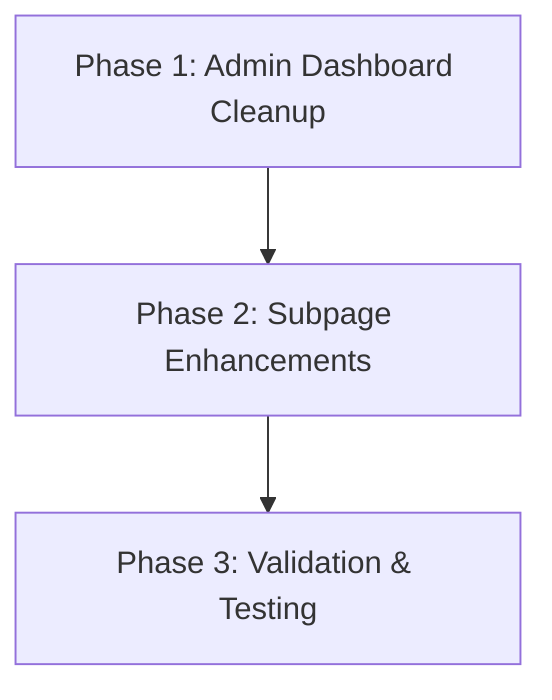

# Implementation Plan: Redirect Always - Transition to /admin/send

**task_complexity**: medium

## 1. Plan Overview
- **Total Phases**: 3
- **Parallelizable Phases**: 0
- **Sequential-only Phases**: 3
- **Estimated Effort**: Low (Primarily deletion and routing updates)

## 2. Dependency Graph

## 3. Execution Strategy

| Phase | Description | Agent | Execution Mode |
|-------|-------------|-------|----------------|
| 1 | Remove modal and wire up redirects in `admin/page.tsx` | `coder` | Sequential |
| 2 | Refine recipient logic in `admin/send/page.tsx` | `coder` | Sequential |
| 3 | Final build verification and linting | `code_reviewer` | Sequential |

---

## 4. Phase Details

### Phase 1: Admin Dashboard Cleanup & Redirect Wiring
**Objective**: Remove the complex "Popup senden" modal from the main Admin page and replace it with navigation to the `/admin/send` subpage.
**Agent**: `coder`

**Files to Modify**:
- `src/app/admin/page.tsx`
  - **Remove**: 
    - `isGiftDialogOpen` state and setter.
    - All gift form states (`giftActionType`, `giftPackCount`, `giftPopupTitle`, etc.).
    - `giftSending` state.
    - `handleGiftPacks` function.
    - The `<Dialog open={isGiftDialogOpen}>` JSX block entirely.
    - `selectAdminMain` function (will be moved to subpage).
  - **Update**:
    - `openSinglePopup(userId)`: Change implementation to `router.push("/admin/send?u=" + userId)`.
    - Bulk "Popup senden" button `onClick`: Change to `sessionStorage.setItem('admin_send_recipients', JSON.stringify(selectedGiftRecipients)); router.push('/admin/send');`.

**Validation**:
- Ensure `src/app/admin/page.tsx` has no remaining references to `isGiftDialogOpen` or `handleGiftPacks`.
- Verify the file compiles without type errors.

---

### Phase 2: Subpage Enhancements
**Objective**: Ensure the `/admin/send` subpage can fully replace all functionality previously available in the modal, including quick recipient additions.
**Agent**: `coder`
**Dependencies**: Phase 1

**Files to Modify**:
- `src/app/admin/send/page.tsx`
  - **Update**:
    - Add the "Admin Main hinzufügen" helper logic to the recipient list section. This requires fetching all profiles or searching for `role === 'admin_main'` and adding them to the `recipients` array if not already present.
    - Ensure `router.back()` or a dedicated "Zurück zur Verwaltung" link is prominent and works cleanly without breaking state.
    - Verify that upon successful send, the user is cleanly redirected back to `/admin` and `sessionStorage` is cleared (already implemented, just needs verification).

**Validation**:
- Ensure the "Admin Main hinzufügen" button is visible and functional when an admin_main is not already in the recipients list.
- Verify the file compiles without type errors.

---

### Phase 3: Validation & Testing
**Objective**: Ensure the entire admin section builds correctly after the refactoring.
**Agent**: `code_reviewer`
**Dependencies**: Phase 2

**Validation Steps**:
- Run `npm run lint` or `npm run build` to catch any dead code, unused imports (like `UniversalBanner` or `Gift` icons that might be left over in `admin/page.tsx`), or broken links.

---

## 5. File Inventory

| File | Phase | Action | Purpose |
|------|-------|--------|---------|
| `src/app/admin/page.tsx` | 1 | Modify | Remove modal, add redirects |
| `src/app/admin/send/page.tsx` | 2 | Modify | Enhance recipient logic |

## 6. Risk Classification
- **Phase 1 (Admin Dashboard Cleanup)**: LOW - Mostly deleting code and updating `onClick` handlers.
- **Phase 2 (Subpage Enhancements)**: LOW - Adding minor features to an already functional subpage.
- **Phase 3 (Validation)**: LOW - Standard verification step.

## 7. Execution Profile
- Total phases: 3
- Parallelizable phases: 0
- Sequential-only phases: 3

## 8. Cost Estimation

| Phase | Agent | Model | Est. Input | Est. Output | Est. Cost |
|-------|-------|-------|-----------|------------|----------|
| 1 | `coder` | Flash | 2,000 | 500 | ~$0.004 |
| 2 | `coder` | Flash | 1,500 | 200 | ~$0.002 |
| 3 | `code_reviewer` | Flash | 3,500 | 50 | ~$0.004 |
| **Total** | | | **7,000** | **750** | **~$0.01** |
