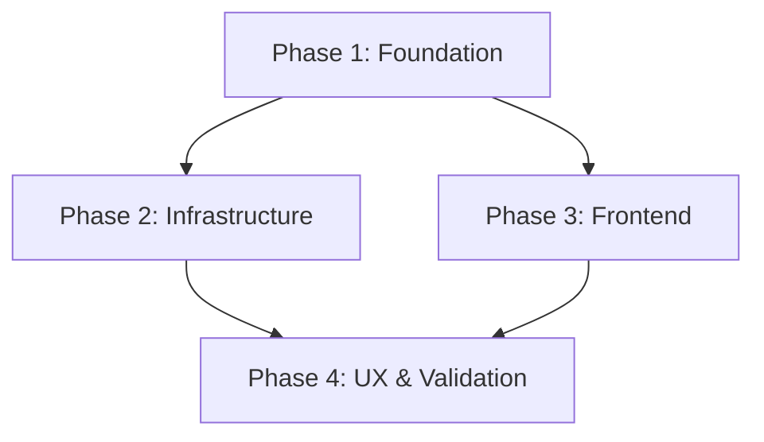

# Implementation Plan: Booster Referral Program

**Date**: 2026-03-26
**Status**: Pending Approval
**Design Document**: [2026-03-26-referral-program-design.md](./2026-03-26-referral-program-design.md)
**Task Complexity**: complex

## 1. Plan Overview
This plan implements a secure, automated booster referral system. It covers database schema updates, a background Cloud Function for rewards, frontend routing for shortened links, and a user-facing dashboard for tracking progress.

- **Total Phases**: 4
- **Total Agents**: 5 (`data_engineer`, `api_designer`, `coder`, `ux_designer`, `tester`)
- **Execution Strategy**: Hybrid (Sequential Foundations, Parallel Frontend/UX)

## 2. Dependency Graph

## 3. Execution Strategy Table

| Stage | Phases | Execution Mode | Agents |
|-------|--------|----------------|--------|
| 1 | 1 | Sequential | `data_engineer` |
| 2 | 2, 3 | Parallel | `api_designer`, `coder` |
| 3 | 4 | Sequential | `ux_designer`, `tester` |

## 4. Phase Details

### Phase 1: Foundation (Data & Schema)
**Objective**: Update the `Profile` schema and create the `referrals` collection to support attribution and limits.
- **Agent**: `data_engineer`
- **Files to Modify**:
    - `src/types/database.ts`: Add `referral_code: string` and `referred_by: string | null` to `Profile`.
- **Files to Create**:
    - `firestore.indexes.json`: Add index for `referrals` (referrerId + timestamp).
- **Implementation Details**:
    - Define `Referral` interface in `src/types/cards.ts` (or dedicated file).
    - Ensure `referral_code` is unique and 6 characters (alphanumeric).
- **Validation**: `tsc`, check Firestore local emulator for index validity.

### Phase 2: Infrastructure (Cloud Logic)
**Objective**: Implement the `onUpdate` Cloud Function to award boosters securely.
- **Agent**: `api_designer`
- **Files to Create**:
    - `functions/src/referrals.ts`: Main logic for `awardReferralBoosters`.
- **Files to Modify**:
    - `functions/src/index.ts`: Export the new referral function.
- **Implementation Details**:
    - Use `onDocumentUpdated("profiles/{uid}")`.
    - Detect first-time population of `name` and `class_name`.
    - Use `runTransaction` to:
        1. Verify `referred_by` exists.
        2. Check monthly limit (25) in `referrals` collection.
        3. Increment `booster_stats.extra_available` for both users.
        4. Create a `referrals` entry.
        5. Check milestone (count of referrals % 5 == 0) and award extra +5.
- **Validation**: `cd functions && npm run build`, unit tests in `functions/__tests__/referrals.test.ts`.

### Phase 3: Frontend (Routing & Registration)
**Objective**: Implement the shortened link redirect and registration attribution.
- **Agent**: `coder`
- **Files to Create**:
    - `src/app/r/[id]/page.tsx`: Capture `:id`, lookup `referrerId`, redirect to `/register?ref=ID`.
- **Files to Modify**:
    - `src/app/register/page.tsx`: Extract `ref` from `useSearchParams` and include it in the initial `Profile` creation.
- **Implementation Details**:
    - `src/app/r/[id]` should be a Server Component for fast lookup/redirect.
- **Validation**: Manual test of `localhost:3000/r/HASH` -> `/register?ref=UID`.

### Phase 4: UX & Validation (Dashboard & Quality)
**Objective**: Create the "Invite Friends" dashboard and perform end-to-end testing.
- **Agent**: `ux_designer`, `tester`
- **Files to Create**:
    - `src/app/einstellungen/referrals/page.tsx`: User dashboard with code, link, and progress.
- **Implementation Details**:
    - `ux_designer`: Implement progress bars for monthly limits and milestone status.
    - `tester`: Create a simulation script to verify that 6 referrals correctly award 35 boosters total (5x6 + 5 milestone) and respect the 25/month cap.
- **Validation**: Build project, verify UI responsiveness, run integration test script.

## 5. File Inventory

| Phase | Action | Path | Purpose |
|-------|--------|------|---------|
| 1 | Modify | `src/types/database.ts` | Schema update for profiles |
| 1 | Create | `firestore.indexes.json` | Indexes for referral queries |
| 2 | Create | `functions/src/referrals.ts` | Background reward logic |
| 2 | Modify | `functions/src/index.ts` | CF Export |
| 3 | Create | `src/app/r/[id]/page.tsx` | Short link redirect |
| 3 | Modify | `src/app/register/page.tsx` | Registration attribution |
| 4 | Create | `src/app/einstellungen/referrals/page.tsx` | User dashboard |

## 6. Execution Profile
- Total phases: 4
- Parallelizable phases: 2 (Phase 2 and 3)
- Sequential-only phases: 2
- Estimated parallel wall time: 3-4 hours
- Estimated sequential wall time: 5-6 hours

## 7. Cost Estimation

| Phase | Agent | Model | Est. Input | Est. Output | Est. Cost |
|-------|-------|-------|-----------|------------|----------|
| 1 | `data_engineer` | Pro | 2500 | 500 | $0.05 |
| 2 | `api_designer` | Pro | 5000 | 2000 | $0.13 |
| 3 | `coder` | Pro | 4000 | 1500 | $0.10 |
| 4 | `ux_designer` | Pro | 4000 | 2000 | $0.12 |
| 4 | `tester` | Pro | 3000 | 1000 | $0.07 |
| **Total** | | | **18500** | **7000** | **$0.47** |
