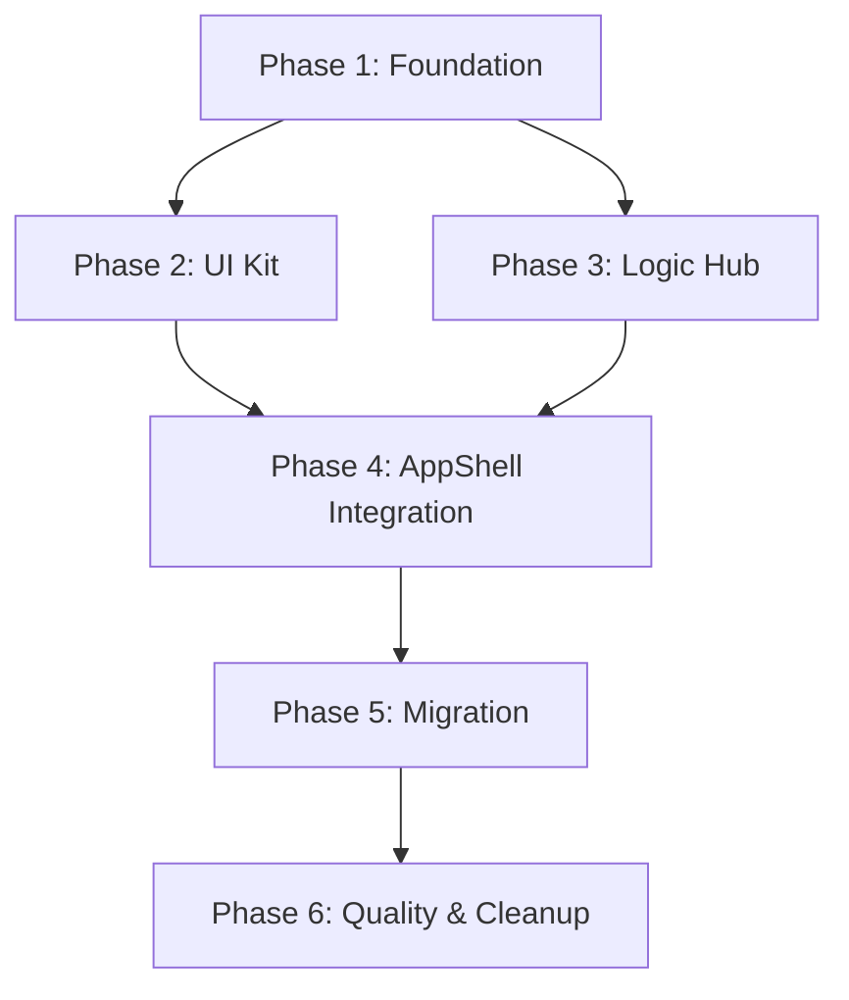

# Implementation Plan: Universal System Message Engine

## Plan Overview
This plan outlines the migration from a fragmented notification system to a unified, modular "System Message Engine". It centralizes data-driven messages (Firestore) and local triggers into a single provider, providing a consistent API for toasts, banners, and modals.

- **Total Phases**: 6
- **Key Agents**: `design_system_engineer`, `coder`, `code_reviewer`
- **Execution Mode**: Phased (Sequential/Parallel where applicable)

## Dependency Graph

## Execution Strategy Table
| Stage | Phases | Agent(s) | Mode |
|-------|--------|----------|------|
| Foundation | 1, 2 | `design_system_engineer` | Sequential |
| Core Logic | 3 | `design_system_engineer` | Sequential |
| Integration | 4 | `coder` | Sequential |
| Migration | 5 | `coder` | Sequential |
| Quality | 6 | `code_reviewer` | Sequential |

## Phase Details

### Phase 1: Foundation (Types & Context)
**Objective**: Establish the core types and the React Context for the system message engine.

- **Agent**: `design_system_engineer`
- **Files to Create**:
    - `src/types/systemMessages.ts`: Define `SystemMessageType` (toast, banner, modal), `SystemMessagePriority`, and `SystemMessage` interfaces.
    - `src/context/SystemMessageContext.tsx`: Implement `SystemMessageProvider` and `useSystemMessage` hook.
- **Files to Modify**:
    - `src/app/layout.tsx`: Wrap the application with `SystemMessageProvider`.
- **Validation**:
    - Verify types compile and `useSystemMessage` is accessible in components.

### Phase 2: UI Kit (Toast, Banner, Modal)
**Objective**: Build the rendering components for each message type.

- **Agent**: `design_system_engineer`
- **Files to Create**:
    - `src/components/layout/SystemMessageHost.tsx`: The central host that renders active messages based on their style.
    - `src/components/ui/system-messages/BannerMessage.tsx`: Refactored `UniversalBanner` as a system message.
    - `src/components/ui/system-messages/ModalMessage.tsx`: Radix UI `Dialog` based modal.
- **Validation**:
    - Build/Lint check. Manual verification of styles (Toast, Banner, Modal).

### Phase 3: Centralized Logic (Firestore Listeners)
**Objective**: Move Firestore listeners and dismissal logic into the `SystemMessageProvider`.

- **Agent**: `design_system_engineer`
- **Files to Modify**:
    - `src/context/SystemMessageContext.tsx`: Implement listeners for `delayed_actions`, `settings/global`, and `profiles/{userId}/unseen_gifts`.
- **Details**:
    - Implement `localStorage` dismissal tracking for recurring banners.
    - Implement logic to convert Firestore docs into `SystemMessage` objects.
- **Validation**:
    - Verify data-driven messages appear in the provider state.

### Phase 4: AppShell Integration
**Objective**: Replace individual banner components in `AppShell` with the new `SystemMessageHost`.

- **Agent**: `coder`
- **Files to Modify**:
    - `src/components/layout/AppShell.tsx`: Remove `DangerAlertBanner`, `WarningBanner`, etc., and add `SystemMessageHost`.
- **Validation**:
    - Ensure all previous banners still appear but are now managed by the provider.

### Phase 5: Migration (Gifts & Local Triggers)
**Objective**: Migrate remaining popups and local triggers (like `sonner` calls).

- **Agent**: `coder`
- **Files to Modify**:
    - `src/components/dashboard/GiftNoticeBanner.tsx`: Update to use `useSystemMessage`.
    - `src/components/dashboard/GiftNoticeModal.tsx`: Update to use `useSystemMessage`.
    - Various files: Replace `toast.success()`, `toast.error()` (sonner) with `useSystemMessage().toast()`.
- **Validation**:
    - Verify gifts and local toasts work as expected.

### Phase 6: Quality Assurance & Cleanup
**Objective**: Final review, removal of deprecated components, and documentation.

- **Agent**: `code_reviewer`
- **Files to Modify**:
    - `src/components/layout/DangerAlertBanner.tsx`: (Delete if unused)
    - `src/components/layout/CustomPopupBanner.tsx`: (Delete if unused)
    - `src/components/layout/UniversalBanner.tsx`: (Delete or keep as legacy)
- **Validation**:
    - Full regression test. Verify no double-rendering.

## File Inventory
| Phase | Action | Path | Purpose |
|-------|--------|------|---------|
| 1 | Create | `src/types/systemMessages.ts` | Type definitions |
| 1 | Create | `src/context/SystemMessageContext.tsx` | State and Logic |
| 1 | Modify | `src/app/layout.tsx` | Provider registration |
| 2 | Create | `src/components/layout/SystemMessageHost.tsx` | Rendering Host |
| 2 | Create | `src/components/ui/system-messages/BannerMessage.tsx` | Banner Component |
| 2 | Create | `src/components/ui/system-messages/ModalMessage.tsx` | Modal Component |
| 3 | Modify | `src/context/SystemMessageContext.tsx` | Firestore Listeners |
| 4 | Modify | `src/components/layout/AppShell.tsx` | AppShell Integration |
| 5 | Modify | `src/components/dashboard/GiftNoticeBanner.tsx` | Gift Migration |
| 5 | Modify | `src/components/dashboard/GiftNoticeModal.tsx` | Gift Migration |
| 6 | Delete | `src/components/layout/DangerAlertBanner.tsx` | Cleanup |

## Risk Classification
- **Phase 3 (Logic Hub)**: HIGH. Complex Firestore logic and dismissal state management.
- **Phase 4 (AppShell Integration)**: MEDIUM. Risk of layout breakage or missing messages.
- **Others**: LOW.

## Execution Profile
- Total phases: 6
- Parallelizable phases: 0 (Strict sequential migration is safer for this refactor)
- Estimated sequential wall time: ~4-6 implementation turns

## Cost Estimation
| Phase | Agent | Model | Est. Input | Est. Output | Est. Cost |
|-------|-------|-------|-----------|------------|----------|
| 1 | `design_system_engineer` | Pro | 3,000 | 1,000 | $0.07 |
| 2 | `design_system_engineer` | Pro | 5,000 | 2,000 | $0.13 |
| 3 | `design_system_engineer` | Pro | 8,000 | 3,000 | $0.20 |
| 4 | `coder` | Pro | 6,000 | 1,500 | $0.12 |
| 5 | `coder` | Pro | 10,000 | 2,500 | $0.20 |
| 6 | `code_reviewer` | Pro | 15,000 | 500 | $0.17 |
| **Total** | | | **47,000** | **10,500** | **$0.89** |
