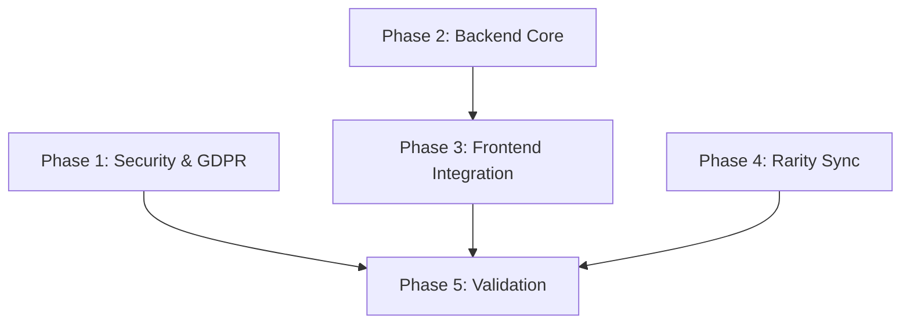

# Implementation Plan: v1.0.0 Readiness Fixes

## 1. Plan Overview
- **Total Phases**: 5
- **Parallelizable Phases**: 2 (Phases 1 and 2 can run concurrently)
- **Estimated Effort**: Medium (Security-focused refactor)
- **Agents Involved**: `security_engineer`, `coder`, `devops_engineer`, `architect`, `compliance_reviewer`

## 2. Dependency Graph

## 3. Execution Strategy
| Stage | Phases | Execution Mode | Agents |
|-------|--------|----------------|--------|
| 1. Foundation | 1, 2 | Parallel | `security_engineer`, `coder` |
| 2. Integration | 3, 4 | Parallel | `coder`, `devops_engineer` |
| 3. Finalization | 5 | Sequential | `architect` |

## 4. Phase Details

### Phase 1: Security Rules & GDPR Cleanup
- **Objective**: Restrict public Firestore access and fix user deletion completeness.
- **Agent**: `security_engineer`
- **Files to Modify**:
  - `firestore.rules`: Replace `allow read: if true;` with auth-checks; restrict `user_teachers` write access.
  - `functions/src/users.ts`: Update `onProfileDeleted` to include `referrals` collection and pseudonymize Stripe records.
- **Validation**:
  - `firebase deploy --only firestore:rules`
  - Unit test for `onProfileDeleted` (simulated).
- **Dependencies**:
  - `blocked_by`: []
  - `blocks`: [5]
  - `parallel`: true

### Phase 2: Backend Core (TCG RNG & Stripe)
- **Objective**: Move card generation to server-side and enforce Stripe billing address.
- **Agent**: `coder`
- **Files to Modify**:
  - `functions/src/shop.ts`: Add `openBooster` Callable Function; update `createStripeCheckoutSession` for billing address.
- **Implementation Details**:
  - `openBooster` should use `config.loot_teachers` and `config.rarity_weights` (fetched from Firestore `settings/sammelkarten`).
  - Perform Firestore transaction: check boosters -> generate cards -> update `user_teachers` -> decrement boosters.
- **Validation**:
  - `npm run build` in `functions/`
  - `firebase deploy --only functions:shop`
- **Dependencies**:
  - `blocked_by`: []
  - `blocks`: [3]
  - `parallel`: true

### Phase 3: Frontend TCG Refactor
- **Objective**: Update the TCG UI to use the new server-side booster opening.
- **Agent**: `coder`
- **Files to Modify**:
  - `src/hooks/useUserTeachers.ts`: Remove client-side RNG; update `collectMassBoosters` to call `openBooster` CF.
  - `src/app/sammelkarten/page.tsx`: Update `generatePack` and `handleOpenPack` to use the server result.
- **Validation**:
  - `npm run build`
  - Manual verification of pack opening animation with server-side result.
- **Dependencies**:
  - `blocked_by`: [2]
  - `blocks`: [5]
  - `parallel`: true

### Phase 4: Global Rarity Sync (Cron)
- **Objective**: Implement 15-minute cron for teacher rarity stability.
- **Agent**: `devops_engineer`
- **Files to Modify**:
  - `functions/src/cron.ts`: Implement `syncTeacherRarities` job.
  - `functions/src/index.ts`: Export the new cron job.
- **Implementation Details**:
  - Fetch all teachers -> calculate average rating -> apply global limits (1 Legendary, 3 Mythic) -> batch update Firestore.
- **Validation**:
  - `firebase deploy --only functions:cron`
  - Trigger function manually via Firebase Console and verify teacher document updates.
- **Dependencies**:
  - `blocked_by`: []
  - `blocks`: [5]
  - `parallel`: true

### Phase 5: Final Validation & Release Gate
- **Objective**: Comprehensive verification of all fixes and documentation update.
- **Agent**: `architect`
- **Files to Modify**:
  - `PROJECT_KNOWLEDGE.md`: Update security and TCG logic sections.
  - `VERSION`: Increment to `0.36.0`.
  - `CHANGELOG.md`: Record all critical fixes.
- **Validation**:
  - `npm run build`
  - `scripts/regression-guard.mjs`
- **Dependencies**:
  - `blocked_by**: [1, 3, 4]
  - `blocks`: []
  - `parallel`: false

## 5. File Inventory
| File | Phase | Purpose |
|------|-------|---------|
| `firestore.rules` | 1 | Zero-Trust rule enforcement |
| `functions/src/users.ts` | 1 | GDPR deletion completeness |
| `functions/src/shop.ts` | 2 | Server-side TCG RNG & Stripe compliance |
| `src/hooks/useUserTeachers.ts` | 3 | TCG integration refactor |
| `src/app/sammelkarten/page.tsx` | 3 | TCG UI refactor |
| `functions/src/cron.ts` | 4 | Global rarity sync job |
| `PROJECT_KNOWLEDGE.md` | 5 | Architecture update |

## 6. Cost Estimation
| Phase | Agent | Model | Est. Input | Est. Output | Est. Cost |
|-------|-------|-------|-----------|------------|----------|
| 1 | `security_engineer` | Pro | 6000 | 1000 | $0.10 |
| 2 | `coder` | Pro | 8000 | 2000 | $0.16 |
| 3 | `coder` | Pro | 8000 | 2000 | $0.16 |
| 4 | `devops_engineer` | Pro | 6000 | 1500 | $0.12 |
| 5 | `architect` | Pro | 10000 | 1000 | $0.14 |
| **Total** | | | **38000** | **7500** | **$0.68** |
