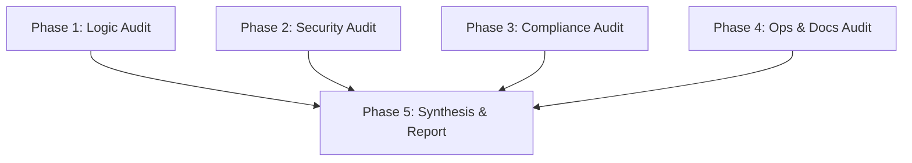

# Implementation Plan: v1.0.0 Readiness Review

## 1. Plan Overview
- **Total Phases**: 5
- **Parallelizable Phases**: 4 (Phases 1-4 can run concurrently)
- **Estimated Effort**: High (Comprehensive multi-domain audit)
- **Agents Involved**: `architect`, `security_engineer`, `compliance_reviewer`, `devops_engineer`

## 2. Dependency Graph

## 3. Execution Strategy
| Stage | Phases | Execution Mode | Agents |
|-------|--------|----------------|--------|
| 1. Parallel Audits | 1, 2, 3, 4 | Parallel | `architect`, `security_engineer`, `compliance_reviewer`, `devops_engineer` |
| 2. Final Review | 5 | Sequential | `architect` |

## 4. Phase Details

### Phase 1: Core Logic & TCG Audit
- **Objective**: Verify functional correctness of TCG rarity, booster logic, and core apps.
- **Agent**: `architect`
- **Files to Read**:
  - `functions/src/rarity.ts`
  - `functions/src/shop.ts`
  - `functions/__tests__/rarity.test.ts`
- **Files to Create**:
  - `docs/maestro/audit-reports/phase1-logic.md` (Audit findings)
- **Validation**: Ensure all edge cases in rarity distribution are covered by tests.
- **Dependencies**:
  - `blocked_by`: []
  - `blocks`: [5]
  - `parallel`: true

### Phase 2: Internal Security Audit
- **Objective**: Audit Firestore rules, Auth enforcement, and the 24h-delay Danger system.
- **Agent**: `security_engineer`
- **Files to Read**:
  - `firestore.rules`
  - `functions/src/danger.ts`
  - `PROJECT_KNOWLEDGE.md` (for Auth rules)
- **Files to Create**:
  - `docs/maestro/audit-reports/phase2-security.md`
- **Validation**: Verify zero-trust model for administrative actions and DB access.
- **Dependencies**:
  - `blocked_by`: []
  - `blocks`: [5]
  - `parallel`: true

### Phase 3: Legal & Tax Compliance Audit
- **Objective**: Audit Stripe checkout for VAT (MwSt) handling and GDPR data flows.
- **Agent**: `compliance_reviewer`
- **Files to Read**:
  - `functions/src/shop.ts`
  - `functions/src/users.ts` (for data deletion/export)
- **Files to Create**:
  - `docs/maestro/audit-reports/phase3-compliance.md`
- **Validation**: Verify German tax compliance in Stripe payloads and GDPR deletion completeness.
- **Dependencies**:
  - `blocked_by`: []
  - `blocks`: [5]
  - `parallel`: true

### Phase 4: CI/CD & Maintainability Audit
- **Objective**: Review test coverage, CI/CD reliability, and project documentation.
- **Agent**: `devops_engineer`
- **Files to Read**:
  - `scripts/regression-guard.mjs`
  - `.github/workflows/regression-guard.yml`
  - `PROJECT_KNOWLEDGE.md`
- **Files to Create**:
  - `docs/maestro/audit-reports/phase4-ops.md`
- **Validation**: Verify CI/CD pipeline correctly gates deployments based on regression tests.
- **Dependencies**:
  - `blocked_by`: []
  - `blocks`: [5]
  - `parallel`: true

### Phase 5: Synthesis & Final GO/NO-GO Report
- **Objective**: Consolidate findings into a definitive release gate report.
- **Agent**: `architect`
- **Files to Read**:
  - `docs/maestro/audit-reports/phase1-logic.md`
  - `docs/maestro/audit-reports/phase2-security.md`
  - `docs/maestro/audit-reports/phase3-compliance.md`
  - `docs/maestro/audit-reports/phase4-ops.md`
- **Files to Create**:
  - `docs/maestro/v1.0.0-readiness-report.md` (Final GO/NO-GO Document)
- **Validation**: User review of the final report.
- **Dependencies**:
  - `blocked_by`: [1, 2, 3, 4]
  - `blocks`: []
  - `parallel`: false

## 5. File Inventory
| File | Phase | Purpose |
|------|-------|---------|
| `docs/maestro/audit-reports/phase1-logic.md` | 1 | TCG/Logic findings |
| `docs/maestro/audit-reports/phase2-security.md` | 2 | Security/Firestore findings |
| `docs/maestro/audit-reports/phase3-compliance.md` | 3 | Legal/Tax findings |
| `docs/maestro/audit-reports/phase4-ops.md` | 4 | CI/CD & Docs findings |
| `docs/maestro/v1.0.0-readiness-report.md` | 5 | Final compiled report |

## 6. Risk Classification
- **Phase 1 (Logic)**: MEDIUM - Complex TCG math might require deep analysis.
- **Phase 2 (Security)**: HIGH - Misconfigured firestore.rules are a launch blocker.
- **Phase 3 (Compliance)**: HIGH - Tax/Stripe errors carry financial liability.
- **Phase 4 (Ops)**: LOW - Mostly verification of existing scripts.
- **Phase 5 (Synthesis)**: LOW - Documentation task.

## 7. Execution Profile
- Total phases: 5
- Parallelizable phases: 4 (in 1 batch)
- Sequential-only phases: 1
- Estimated parallel wall time: ~5-10 minutes
- Estimated sequential wall time: ~20-30 minutes

## 8. Cost Estimation
| Phase | Agent | Model | Est. Input | Est. Output | Est. Cost |
|-------|-------|-------|-----------|------------|----------|
| 1 | `architect` | Pro | 8000 | 1000 | $0.12 |
| 2 | `security_engineer` | Pro | 5000 | 1000 | $0.09 |
| 3 | `compliance_reviewer` | Pro | 5000 | 1000 | $0.09 |
| 4 | `devops_engineer` | Pro | 6000 | 1000 | $0.10 |
| 5 | `architect` | Pro | 6000 | 2000 | $0.14 |
| **Total** | | | **30000** | **6000** | **$0.54** |
