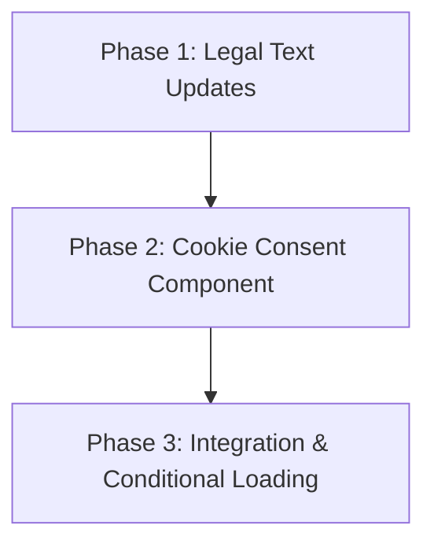

# Implementation Plan: Legal Checkup & Compliance (v1.0.0 Readiness)

**Date:** 2026-03-30
**Topic Slug:** legal-checkup-compliance
**Task Complexity:** medium

## 1. Plan Overview
This plan implements the legal fixes and GDPR-compliant cookie consent mechanism for the ABI Planer.
- **Total Phases:** 3
- **Agents Involved:** `technical_writer`, `coder`
- **Estimated Effort:** ~1-2 hours

## 2. Dependency Graph

## 3. Execution Strategy Table
| Stage | Phases | Execution Mode | Agent(s) |
|-------|--------|----------------|----------|
| 1 | 1 | Sequential | `technical_writer` |
| 2 | 2 | Sequential | `coder` |
| 3 | 3 | Sequential | `coder` |

## 4. Phase Details

### Phase 1: Legal Text Updates
**Objective:** Ensure all legal texts are accurate and synchronized.
**Agent:** `technical_writer`
**Files to Modify:**
- `src/app/impressum/page.tsx`: 
    - Update address: `Ahornweg 6d, 01454 Wachau`.
    - Update contact: `Tel: 017636370172` (normalized).
- `src/app/register/page.tsx`:
    - Update `terms_version` to `2026-03-29`.
- `src/app/datenschutz/page.tsx`:
    - Update section 8 (Google AdSense) to mention that cookies are only set *after* user consent.
**Validation:**
- Visual check of the pages.
- Verify `terms_version` string match.

### Phase 2: Cookie Consent Component
**Objective:** Create a custom UI for cookie consent.
**Agent:** `coder`
**Files to Create:**
- `src/components/layout/CookieConsent.tsx`:
    - Fixed bottom banner.
    - Blur background, shadcn/ui buttons ("Akzeptieren", "Ablehnen").
    - Logic to store `cookie-consent-accepted` in `localStorage`.
    - Trigger a custom event or use a state that `layout.tsx` can consume.
**Validation:**
- Component renders on initial visit.
- Clicking "Akzeptieren" hides the banner and sets `localStorage`.

### Phase 3: Integration & Conditional Loading
**Objective:** Prevent AdSense from loading before consent.
**Agent:** `coder`
**Files to Modify:**
- `src/app/layout.tsx`:
    - Remove the hardcoded `<script>` tag for AdSense.
    - Implement a client-side wrapper or script injector that checks `localStorage`.
- `src/components/layout/GoogleAdSense.tsx`:
    - (Optional) Ensure the placeholder also respects the consent state.
**Validation:**
- Use Browser DevTools to verify `pagead2.googlesyndication.com` is NOT called until "Akzeptieren" is clicked.
- Verify persistence after page reload.

## 5. File Inventory
| Phase | Action | Path | Purpose |
|-------|--------|------|---------|
| 1 | Modify | `src/app/impressum/page.tsx` | Legal address update |
| 1 | Modify | `src/app/register/page.tsx` | Version synchronization |
| 1 | Modify | `src/app/datenschutz/page.tsx` | GDPR compliance text |
| 2 | Create | `src/components/layout/CookieConsent.tsx` | Consent UI |
| 3 | Modify | `src/app/layout.tsx` | Conditional script loading |

## 6. Risk Classification
| Phase | Risk | Rationale |
|-------|------|-----------|
| 1 | LOW | Text-only changes. |
| 2 | LOW | New component, low side-effect risk. |
| 3 | MEDIUM | Script injection order can affect hydration or ad delivery. |

## 7. Execution Profile
- Total phases: 3
- Parallelizable phases: 0 (Sequential due to dependency on text/logic flow)
- Sequential-only phases: 3

## 8. Cost Estimation
| Phase | Agent | Model | Est. Input | Est. Output | Est. Cost |
|-------|-------|-------|-----------|------------|----------|
| 1 | `technical_writer` | Flash | 5K | 1K | ~$0.01 |
| 2 | `coder` | Pro | 10K | 2K | ~$0.18 |
| 3 | `coder` | Pro | 10K | 1K | ~$0.14 |
| **Total** | | | **25K** | **4K** | **~$0.33** |
