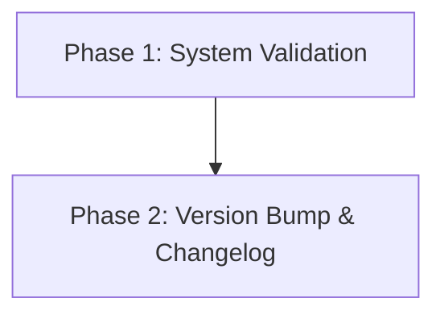

# Implementation Plan

## 1. Plan Overview
- Total Phases: 2
- Agents: `devops_engineer`, `coder`
- Estimated Cost: ~$0.05

## 2. Dependency Graph

## 3. Execution Strategy
| Stage | Phase | Objective | Agent | Mode |
|-------|-------|-----------|-------|------|
| 1 | Phase 1 | Run validation scripts | `devops_engineer` | Sequential |
| 2 | Phase 2 | Increment version and update changelog | `coder` | Sequential |

## 4. Phase Details

### Phase 1: System Validation
- **Objective:** Run Next.js check and Firebase functions build to ensure code stability.
- **Agent:** `devops_engineer` (Best for CI/CD tasks)
- **Files Modified:** None
- **Implementation Details:**
  1. Run `npm run check` in the root directory.
  2. Run `cd functions && npm run build`.
- **Validation Criteria:** Both scripts must complete with exit code 0.
- **Dependencies:** None (`blocked_by: []`)

### Phase 2: Version Bump & Changelog
- **Objective:** Update versions to 1.3.0 and compile a grouped commit summary.
- **Agent:** `coder`
- **Files Modified:**
  - `VERSION`: Increment from 1.2.52 to 1.3.0.
  - `package.json`: Update version to 1.3.0.
  - `CHANGELOG.md`: Read recent commits, group by Features/Fixes, and add an entry for `[1.3.0] - 2026-04-06`.
- **Implementation Details:**
  1. Retrieve recent `git log` output.
  2. Categorize them into a summarized format.
  3. Prepend to `CHANGELOG.md`.
  4. Write `1.3.0` to `VERSION`.
  5. Manually update `package.json` to 1.3.0.
- **Validation Criteria:** Verify files are updated and changelog matches the requested format.
- **Dependencies:** Phase 1 (`blocked_by: [1]`)

## 5. Token Budget Estimation
| Phase | Agent | Model | Est. Input | Est. Output | Est. Cost |
|-------|-------|-------|-----------|------------|----------|
| 1 | `devops_engineer` | Default | 1000 | 100 | $0.01 |
| 2 | `coder` | Default | 2000 | 500 | $0.04 |
| **Total** | | | **3000** | **600** | **$0.05** |

## 6. Execution Profile
- Total phases: 2
- Parallelizable phases: 0
- Sequential-only phases: 2
