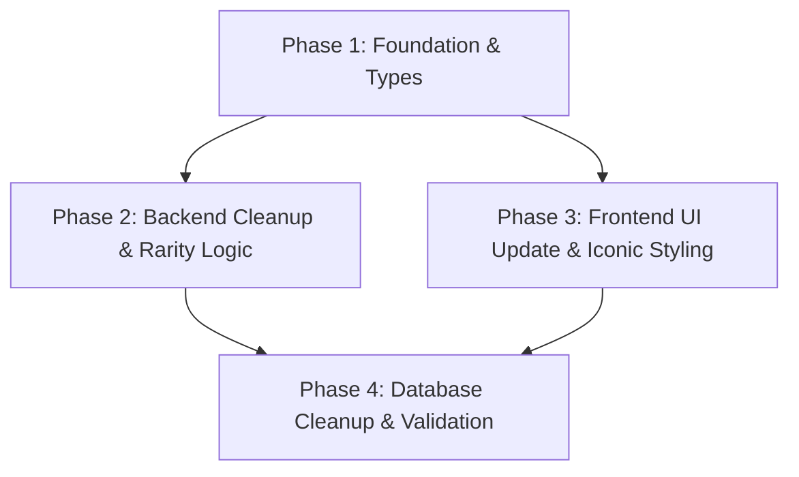

# Implementation Plan: Rarity Expansion & Voting Cleanup

This plan covers the transition from a crowdsourced teacher rarity system to a purely administrative one, including the introduction of the "Iconic" tier.

## 1. Plan Overview
- **Total Phases**: 4
- **Agents**: `data_engineer`, `coder`, `tester`
- **Estimated Effort**: Medium

## 2. Dependency Graph

## 3. Execution Strategy

| Stage | Phase | Agent | Mode |
|-------|-------|-------|------|
| 1 | Phase 1: Foundation & Types | `coder` | Sequential |
| 2 | Phase 2: Backend Cleanup | `coder` | Parallel |
| 2 | Phase 3: Frontend UI | `coder` | Parallel |
| 3 | Phase 4: Database Cleanup | `data_engineer` | Sequential |

## 4. Phase Details

### Phase 1: Foundation & Types
**Objective**: Expand the `TeacherRarity` type and update core interfaces.

- **Files to Modify**:
    - `src/types/database.ts`: Add `iconic` to `TeacherRarity`. Remove `avg_rating` and `vote_count` from `Teacher` interface. Remove `TeacherRating` interface and `rated_teachers` from `Profile`.
    - `src/types/cards.ts`: Ensure `TeacherRarity` is synced if imported/redefined.
    - `functions/src/rarity.ts`: Update `TeacherRarity` type.

**Validation**:
- `npm run lint` and `tsc --noEmit` to ensure type consistency.

---

### Phase 2: Backend Cleanup & Rarity Logic
**Objective**: Remove voting functions and update rarity thresholds/balancing.

- **Files to Modify**:
    - `functions/src/rarity.ts`: 
        - Remove `voteForTeacher` and `calculateTeacherRarity` (onDocumentWritten).
        - Update `calculateRarityFromAverage` (though average is gone, logic might be reused by admin).
        - Update `applyRarityLimits` to include `iconic`.
    - `functions/src/index.ts`: Remove export of `voteForTeacher`.
    - `functions/src/cron.ts`: Remove or update `syncTeacherRarities`.
    - `functions/package.json`: Check if any voting-specific deps can be removed.

**Validation**:
- Deploy functions (dry run or to staging) and verify no exports of `voteForTeacher`.

---

### Phase 3: Frontend UI Update & Iconic Styling
**Objective**: Remove voting UI and implement Iconic rarity visuals.

- **Files to Create**:
    - `scripts/cleanup-voting-data.ts`: Script to wipe `avg_rating`/`vote_count` and delete `teacher_ratings`.

- **Files to Modify**:
    - `src/components/cards/RaritySymbol.tsx`: Add "Crown" SVG and Iconic styling (Black/Gold).
    - `src/app/abstimmungen/page.tsx`: Remove `TeacherRarityVoting` usage.
    - `src/components/dashboard/TeacherRarityVoting.tsx`: Delete this file.
    - `src/app/sammelkarten/page.tsx`: Update `getTeacherRarityHex` and default weights.
    - `src/app/admin/sammelkarten/page.tsx`: Update admin rarity selection and simulation.
    - `src/hooks/useUserTeachers.ts`: Remove `claimExtraBoosters` if tied to voting (checked: it's a generic gift but mentions `booster_stats`). Clean up any voting reward logic.

**Validation**:
- Visual check of Iconic cards. Verify `/abstimmungen` page loads without voting section.

---

### Phase 4: Database Cleanup & Validation
**Objective**: Execute data purge and perform final integration tests.

- **Execution**:
    - Run the cleanup script (Data Engineer).
    - Manual verification in Firestore console.
    - Run pack simulation to verify `iconic` drop rates.

**Validation**:
- Pack opening simulation.
- Smoke test: Browse album, open pack, view admin dashboard.

## 5. File Inventory

| Phase | Action | Path | Purpose |
|-------|--------|------|---------|
| 1 | Modify | `src/types/database.ts` | Base type expansion |
| 2 | Modify | `functions/src/rarity.ts` | Backend logic cleanup |
| 2 | Modify | `functions/src/index.ts` | API export cleanup |
| 3 | Modify | `src/components/cards/RaritySymbol.tsx` | Visual identity |
| 3 | Modify | `src/app/abstimmungen/page.tsx` | UI cleanup |
| 3 | Delete | `src/components/dashboard/TeacherRarityVoting.tsx` | Code removal |
| 4 | Create | `scripts/cleanup-voting-data.ts` | One-time migration |

## 6. Execution Profile
- Total phases: 4
- Parallelizable phases: 2 (Phase 2 & 3)
- Sequential-only phases: 2
- Estimated parallel wall time: 2-3 hours

| Phase | Agent | Model | Est. Input | Est. Output | Est. Cost |
|-------|-------|-------|-----------|------------|----------|
| 1 | `coder` | Flash | 10k | 2k | $0.02 |
| 2 | `coder` | Flash | 15k | 3k | $0.03 |
| 3 | `coder` | Flash | 20k | 5k | $0.05 |
| 4 | `data_engineer` | Pro | 10k | 2k | $0.18 |
| **Total** | | | | | **~$0.28** |
